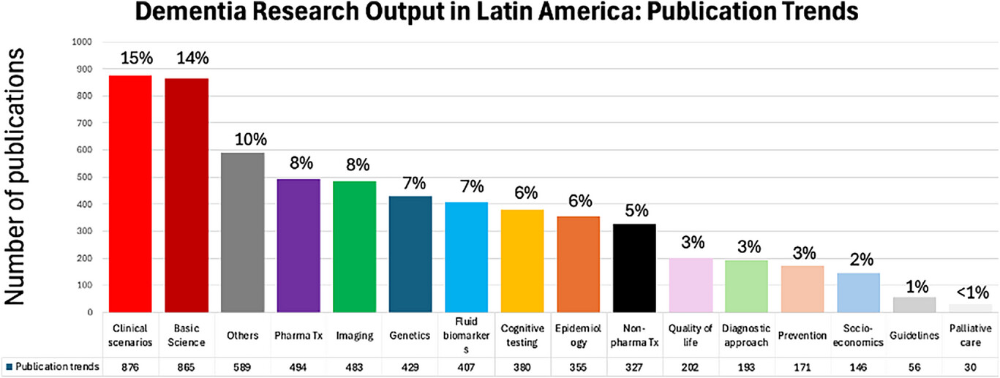

### Why is text-mining useful for dementia research?

```{=html}
<ul class="summary-list">
<li class="fragment" data-fragment-index="1">
  <strong>The literature is unreadable by humans alone.</strong>
  <span class="fragment summary-body" data-fragment-index="1">
    Over 200,000 ADRD papers were published 1990–2024 with thousands more
    each year — no researcher or leadership team can keep pace without
    computational synthesis (Vazquez-Guajardo et al., <em>Alz &amp; Dem</em>
    2026).
  </span>
</li>
<li class="fragment" data-fragment-index="2">
  <strong>Surfaces funding gaps and over-investment.</strong>
  <span class="fragment summary-body" data-fragment-index="2">
    CADRO / IADRP-style portfolio classification reveals where global
    dementia spend concentrates (mechanisms, diagnosis) and where it&rsquo;s
    under-weighted (drug development, risk reduction, clinical trials) —
    actionable evidence for funders to rebalance.
  </span>
</li>
<li class="fragment" data-fragment-index="3">
  <strong>Generates testable drug-repurposing hypotheses.</strong>
  <span class="fragment summary-body" data-fragment-index="3">
    Knowledge-graph approaches (SemMedDB, Hetionet, AGATHA) trace from
    Swanson&rsquo;s original literature-based discovery of indomethacin and
    estrogen links to AD through to modern AI-driven target prioritisation
    across millions of biomedical relations.
  </span>
</li>
<li class="fragment" data-fragment-index="4">
  <strong>Audits the credibility of upstream evidence.</strong>
  <span class="fragment summary-body" data-fragment-index="4">
    Tools like Scite.ai classify 1.6+ billion citation statements as
    <em>supporting</em>, <em>contrasting</em> or <em>mentioning</em>,
    directly addressing the replication and statistical-power concerns
    Button et al. (2013) raised for neuroscience.
  </span>
</li>
<li class="fragment" data-fragment-index="5">
  <strong>Detects emerging science before consensus forms.</strong>
  <span class="fragment summary-body" data-fragment-index="5">
    Citation-burst and keyword-trend analysis in CiteSpace, VOSviewer and
    Dimensions act as leading indicators of momentum — tau biomarkers,
    gut–brain axis, ocular biomarkers — long before lagging citation counts
    move.
  </span>
</li>
<li class="fragment" data-fragment-index="6">
  <strong>Extracts structured knowledge from unstructured text.</strong>
  <span class="fragment summary-body" data-fragment-index="6">
    Biomedical NLP models (BioBERT, SciBERT, PubTator 3.0) recognise genes,
    proteins, variants, diseases and drugs across full-text, turning PDFs
    into machine-actionable data linked to Open Targets, DisGeNET and
    Alzforum.
  </span>
</li>
<li class="fragment" data-fragment-index="7">
  <strong>Benchmarks Institute performance against the global field.</strong>
  <span class="fragment summary-body" data-fragment-index="7">
    Bibliometric analysis of UK DRI outputs against IADRP and OpenAlex
    provides a quantitative complement to expert review — exposing
    collaboration patterns, citation context and translational reach.
  </span>
</li>
<li class="fragment" data-fragment-index="8">
  <strong>Operationalises FAIR at scale.</strong>
  <span class="fragment summary-body" data-fragment-index="8">
    Europe PMC&rsquo;s ~1.6 billion text-mined annotations across 46 M
    abstracts and 9.9 M open-access full-texts make the literature
    Findable, Accessible, Interoperable and Reusable for downstream tools
    and AI pipelines.
  </span>
</li>
</ul>
```

::: {.example-figure .fragment .current-visible data-fragment-index="1"}

:::

```{=html}
<style>
/* UK DRI workshop title-slide accent
   --------------------------------------------------
   The base reveal.js title slide gets a deep-navy
   background (set in YAML) with a coral accent rule
   under the title and white text. */
.reveal #title-slide {
  text-align: left;
  padding-left: 4rem;
  padding-right: 4rem;
  color: #ffffff;
}
.reveal #title-slide h1.title {
  color: #ffffff;
  font-size: 2.1em;
  font-weight: 600;
  line-height: 1.15;
  margin-bottom: 0.4em;
  padding-bottom: 0.5em;
  border-bottom: 4px solid #e94e1b; /* UK DRI coral */
  max-width: 95%;
}
.reveal #title-slide p.subtitle {
  color: #e6ecf5;
  font-size: 1.05em;
  font-style: italic;
  font-weight: 300;
  margin-top: 0.3em;
  margin-bottom: 1.6em;
}
.reveal #title-slide .quarto-title-author-name,
.reveal #title-slide .quarto-title-authors {
  color: #ffffff;
  font-size: 1.0em;
  font-weight: 500;
}
.reveal #title-slide .quarto-title-affiliation,
.reveal #title-slide .quarto-title-affiliations {
  color: #b8c4d6;
  font-size: 0.82em;
  font-style: normal;
  font-weight: 300;
  margin-top: 0.15em;
}
.reveal #title-slide .date,
.reveal #title-slide p.date {
  color: #b8c4d6;
  font-size: 0.85em;
  margin-top: 2.2em;
  letter-spacing: 0.05em;
  text-transform: uppercase;
}

/* Global slide-deck footer: two logos pinned to the bottom of every
   slide. Both logos are dark on white (UK DRI mark is navy on white;
   Surrey mark is gold deer + navy text on white), so each sits on a
   white card and stays legible on any slide background — including the
   navy title and "Thank You" slides. */
.reveal::before,
.reveal::after {
  content: "";
  position: absolute;
  bottom: 0.4rem;
  width: 190px;
  height: 36px;
  background-repeat: no-repeat;
  background-position: center;
  background-size: 160px auto;
  border-radius: 4px;
  z-index: 30;
  pointer-events: none;
}
.reveal::before {
  left: 1rem;
  background-color: #ffffff;
  background-image: url('https://www.ukdri.ac.uk/themes/custom/ukdri/assets/img/logo.svg');
}
.reveal::after {
  right: 1rem;
  background-color: #ffffff;
  background-image: url('assets/surrey.png');
}

/* Chart-sizing helpers attached to `###` headings via `{.chart-fit}` etc.
   Every targeted chart's SVG carries a viewBox (Plot.plot or bare d3),
   so constraining max-width / max-height plus aspect-ratio preservation
   makes them fill the available slide area on resize. */
.reveal .slide.chart-fit {
  display: flex !important;
  flex-direction: column;
  justify-content: center;
}
.reveal .slide.chart-fit svg,
.reveal .slide.chart-fit .cell-output-display svg {
  max-width: 100%;
  max-height: 72vh;
  width: auto !important;
  height: auto !important;
  display: block;
  margin: 0 auto;
}
.reveal .slide.chart-square svg {
  width: 72vh !important;
  height: 72vh !important;
  max-width: 100% !important;
  display: block;
  margin: 0 auto;
}
.reveal .slide.chart-centered {
  display: flex !important;
  flex-direction: column;
  justify-content: center;
  align-items: center;
}

/* "Summary-on-advance" bullet pattern. Each bullet body expands when its
   bullet is the active fragment and collapses back to nothing when the
   next bullet is revealed — so a long list fits on one slide while only
   the currently-active body is shown in full. */
.reveal .summary-list { line-height: 1.35; padding-left: 1.3em; }
.reveal .summary-list > li { margin-bottom: 0.15em; }
.reveal .summary-body {
  display: block;
  max-height: 0;
  overflow: hidden;
  opacity: 0;
  margin: 0;
  font-weight: 400;
  color: #475168;
  transition: max-height 0.28s ease, opacity 0.2s ease,
              margin-top 0.28s ease, margin-bottom 0.28s ease;
}
.reveal .summary-body.current-fragment {
  max-height: 10em;
  opacity: 1;
  margin-top: 0.18em;
  margin-bottom: 0.45em;
}

/* Inline example figure that appears below the summary-list with
   bullet 1. Sized to coexist with any expanded summary-body inside the
   1280x800 slide without triggering scrollable overflow. Click the
   image to expand it via Quarto's lightbox filter. */
.reveal .example-figure {
  margin: 0.3em auto 0;
  text-align: center;
}
.reveal .example-figure img {
  max-width: 62%;
  max-height: 170px;
  height: auto;
  width: auto;
  border-radius: 4px;
  box-shadow: 0 2px 8px rgba(11,31,58,0.12);
  cursor: zoom-in;
}
.reveal .example-figure figcaption,
.reveal .example-figure p {
  font-size: 0.48em;
  color: #5b6b80;
  margin-top: 0.25em;
  line-height: 1.25;
}
</style>
```

```{python}
#| label: setup
import sqlite3
import json as _json
from datetime import date as _date
from pathlib import Path

DB_PATH = Path("../.pipeline/openalex.sqlite")
STATE_DB_PATH = Path("../.pipeline/state.sqlite")

# Rolling 5-year window anchored at render time (matches the
# `ukdri_funded_5y` corpus's own 5-year recency rule). Clamps Feb-29
# to Feb-28 in non-leap target years.
_today = _date.today()
try:
    _min = _today.replace(year=_today.year - 5)
except ValueError:
    _min = _today.replace(year=_today.year - 5, day=28)
MIN_DATE = _min.isoformat()

# Corpus: the Zotero sub-collection `ukdri_funded_5y` (key TXJH46JE).
# This collection is built by `scripts/zotero_add_ukdri_5y.py`, which
# queries OpenAlex with `funders.id=F4320329730` (UKDRI) restricted to
# the last 5 years. Every chart in this report is restricted to items
# that belong to this collection in `state.sqlite`.
COLLECTION_KEY = "TXJH46JE"

# Scope: only primary-research items. Reviews, book chapters, editorials,
# letters and errata are excluded everywhere downstream because the FAIR /
# ODDPub signals (open data, open code, deposition statements) only make
# sense for papers that produce primary research output.
ALLOWED_TYPES = ("article", "preprint")

# Resolve the collection's item_keys once. We pass them into every
# downstream query as a JSON-encoded `item_key IN (json_each(?))`
# fragment, mirroring the existing UKDRI-funded filter pattern.
_state_con = sqlite3.connect(STATE_DB_PATH)
collection_keys_set = {
    r[0]
    for r in _state_con.execute(
        "SELECT item_key FROM items WHERE collection_key = ?",
        (COLLECTION_KEY,),
    )
}
_state_con.close()
collection_keys_json = _json.dumps(sorted(collection_keys_set))
n_collection_total = len(collection_keys_set)

con = sqlite3.connect(DB_PATH)
date_range = con.execute("""
    SELECT
        strftime('%Y-%m', MIN(publication_date)),
        strftime('%Y-%m', MAX(publication_date))
    FROM works
    WHERE status='ok' AND type IN ('article','preprint') AND publication_date >= ?
      AND item_key IN (SELECT value FROM json_each(?))
""", (MIN_DATE, collection_keys_json)).fetchone()

total_papers = con.execute("""
    SELECT COUNT(*) FROM works
    WHERE status='ok' AND type IN ('article','preprint') AND publication_date >= ?
      AND item_key IN (SELECT value FROM json_each(?))
""", (MIN_DATE, collection_keys_json)).fetchone()[0]

# Excluded-type composition for transparency (so readers know what's filtered).
excluded_rows = con.execute("""
    SELECT type, COUNT(*) AS n
    FROM works
    WHERE status='ok' AND publication_date >= ?
      AND type NOT IN ('article','preprint')
      AND item_key IN (SELECT value FROM json_each(?))
    GROUP BY type ORDER BY n DESC
""", (MIN_DATE, collection_keys_json)).fetchall()

# ---- Filter-funnel data for the staged-filtering Sankey diagram. ----
# Stage 1: enrichment outcome.
_n_enriched_ok = con.execute(
    "SELECT COUNT(*) FROM works WHERE status='ok' "
    "AND item_key IN (SELECT value FROM json_each(?))",
    (collection_keys_json,),
).fetchone()[0]
_n_not_found = con.execute(
    "SELECT COUNT(*) FROM works WHERE status='not_found' "
    "AND item_key IN (SELECT value FROM json_each(?))",
    (collection_keys_json,),
).fetchone()[0]
_n_missing = n_collection_total - _n_enriched_ok - _n_not_found
# Stage 2: full type breakdown over enriched items.
funnel_types = [
    {"type": t or "unknown", "count": n}
    for t, n in con.execute(
        "SELECT COALESCE(NULLIF(type,''), 'unknown') AS t, COUNT(*) AS n "
        "FROM works WHERE status='ok' "
        "AND item_key IN (SELECT value FROM json_each(?)) "
        "GROUP BY t ORDER BY n DESC",
        (collection_keys_json,),
    ).fetchall()
]
# Stage 3: per-type within-window counts (only article+preprint matter).
def _within(_t: str) -> int:
    return con.execute(
        "SELECT COUNT(*) FROM works "
        "WHERE status='ok' AND type=? AND publication_date >= ? "
        "AND item_key IN (SELECT value FROM json_each(?))",
        (_t, MIN_DATE, collection_keys_json),
    ).fetchone()[0]

funnel_pipeline = {
    "n_total": n_collection_total,
    "enriched_ok": _n_enriched_ok,
    "not_found": _n_not_found,
    "missing": _n_missing,
    "types": funnel_types,
    "article_within": _within("article"),
    "preprint_within": _within("preprint"),
    "min_date": MIN_DATE,
}
con.close()

date_label = f"{date_range[0]} to {date_range[1]}" if date_range[0] else ""
excluded_label = (
    "; ".join(f"{n} {t}{'s' if n != 1 else ''}" for t, n in excluded_rows)
    or "none"
)
ojs_define(
    date_range_label=date_label,
    total_papers=total_papers,
    excluded_label=excluded_label,
    n_collection_total=n_collection_total,
    min_date=MIN_DATE,
    funnel_pipeline=funnel_pipeline,
)


def _ukdri_filter_sql(ukdri_only: bool = False, alias: str = "w") -> tuple[str, tuple]:
    """Return (SQL fragment, params) restricting to the ukdri_funded_5y
    collection (TXJH46JE). Every chart-data query in this report appends
    this fragment so the corpus stays consistent across panels.

    The legacy ``ukdri_only`` parameter is retained for call-site
    compatibility but is now a no-op: the entire collection was built
    from the OpenAlex UKDRI funder filter, so a per-chart "UKDRI-funded
    only" toggle would always be redundant.
    """
    del ukdri_only  # legacy: see docstring
    return (
        f" AND {alias}.item_key IN (SELECT value FROM json_each(?))",
        (collection_keys_json,),
    )
```

```{ojs}
function addPlotLegendHighlight(node) {
  const swatchContainer = node.querySelector('[class*="swatches"]');
  if (!swatchContainer) return node;
  const mainSvg = node.querySelector('svg[viewBox]');
  if (!mainSvg) return node;

  const swatches = Array.from(swatchContainer.children).filter(el => el.tagName === 'SPAN');
  const marks = mainSvg.querySelectorAll(
    'g[aria-label="bar"] rect, g[aria-label="dot"] circle, ' +
    'g[aria-label="line"] path, g[aria-label="area"] path'
  );

  swatches.forEach(swatch => {
    const swatchSvg = swatch.querySelector('svg');
    if (!swatchSvg) return;
    const swatchColor = swatchSvg.getAttribute('fill');
    swatch.style.cursor = 'pointer';
    swatch.addEventListener('mouseenter', () => {
      marks.forEach(mark => {
        const c = mark.getAttribute('fill') || mark.getAttribute('stroke');
        mark.style.transition = 'opacity 150ms';
        mark.style.opacity = c === swatchColor ? 1 : 0.1;
      });
    });
    swatch.addEventListener('mouseleave', () => {
      marks.forEach(mark => {
        mark.style.transition = 'opacity 150ms';
        mark.style.opacity = '';
      });
    });
  });
  return node;
}

{
  const observer = new MutationObserver(() => {
    document.querySelectorAll('figure').forEach(fig => {
      if (fig.dataset.legendHighlight) return;
      const sc = fig.querySelector('[class*="swatches"]');
      if (!sc) return;
      fig.dataset.legendHighlight = '1';
      addPlotLegendHighlight(fig);
    });
  });
  observer.observe(document.body, { childList: true, subtree: true });
  yield html``;
  observer.disconnect();
}
```


### Filtering pipeline {.chart-fit}

```{ojs}
sankey_module = await import("https://cdn.jsdelivr.net/npm/d3-sankey@0.12.3/+esm")
```

```{ojs}
//| label: filter-funnel-sankey
filter_sankey_chart = {
  const data = funnel_pipeline;
  const sk = sankey_module;

  const nodes = [];
  const links = [];
  const known = new Set();
  const add = (id, name, kind) => {
    known.add(id);
    nodes.push({id, name, kind});
  };
  const link = (a, b, v) => {
    if (v > 0 && known.has(a) && known.has(b)) {
      links.push({source: a, target: b, value: v});
    }
  };

  // Stage 0 — Corpus
  add("corpus", `UK DRI funded corpus\n${data.n_total.toLocaleString()}`, "corpus");

  // Stage 1 — Enrichment outcome
  add("enriched", `Enriched in OpenAlex\n${data.enriched_ok.toLocaleString()}`, "kept");
  if (data.not_found > 0) add("not_found", `Not in OpenAlex\n${data.not_found}`, "leak");
  if (data.missing > 0)   add("missing",   `No OA row\n${data.missing}`,        "leak");
  link("corpus", "enriched", data.enriched_ok);
  link("corpus", "not_found", data.not_found);
  link("corpus", "missing",  data.missing);

  // Label map: raw OpenAlex type → sentence-case display label
  const typeLabel = t => {
    const map = {
      "article": "Article", "preprint": "Preprint", "review": "Review",
      "letter": "Letter", "peer-review": "Peer review", "erratum": "Erratum",
      "editorial": "Editorial", "dataset": "Dataset", "book-chapter": "Book chapter",
      "dissertation": "Dissertation", "paratext": "Paratext",
    };
    return map[t] || (t.charAt(0).toUpperCase() + t.slice(1));
  };

  // Stage 2 — Type breakdown of enriched items
  const primary = new Set(["article", "preprint"]);
  for (const t of data.types) {
    const id = `type_${t.type}`;
    add(id, `${typeLabel(t.type)}\n${t.count.toLocaleString()}`, primary.has(t.type) ? "kept" : "leak");
    link("enriched", id, t.count);
  }

  // Stage 3 — Date filter (rolling 5y) on article + preprint
  const articleCount  = (data.types.find(t => t.type === "article")  || {count: 0}).count;
  const preprintCount = (data.types.find(t => t.type === "preprint") || {count: 0}).count;
  const articleOutside  = articleCount  - data.article_within;
  const preprintOutside = preprintCount - data.preprint_within;
  const totalWithin     = data.article_within + data.preprint_within;
  const totalOutside    = articleOutside + preprintOutside;

  add("eligible", `Eligible (≥ ${data.min_date})\n${totalWithin.toLocaleString()}`, "final");
  if (totalOutside > 0) add("outside", `Outside date window\n${totalOutside}`, "leak");
  link("type_article",  "eligible", data.article_within);
  link("type_preprint", "eligible", data.preprint_within);
  link("type_article",  "outside",  articleOutside);
  link("type_preprint", "outside",  preprintOutside);

  const colors = {corpus: "#37474f", kept: "#3a87ad", final: "#59a14f", leak: "#e15759"};

  const width = 920;
  const height = 460;

  const layout = sk.sankey()
    .nodeId(d => d.id)
    .nodeWidth(14)
    .nodePadding(10)
    .nodeAlign(sk.sankeyJustify)
    .extent([[1, 6], [width - 220, height - 6]]);

  const graph = layout({
    nodes: nodes.map(n => ({...n})),
    links: links.map(l => ({...l}))
  });

  const svg = d3.create("svg")
    .attr("viewBox", [0, 0, width, height])
    .attr("width", width)
    .attr("height", height)
    .attr("style", "max-width: 100%; height: auto; font: 11px sans-serif");

  // Links
  svg.append("g").attr("fill", "none").attr("stroke-opacity", 0.45)
    .selectAll("path")
    .data(graph.links)
    .join("path")
      .attr("d", sk.sankeyLinkHorizontal())
      .attr("stroke", d => colors[d.target.kind] || "#999")
      .attr("stroke-width", d => Math.max(1, d.width))
    .append("title")
      .text(d => `${d.source.name.split('\n')[0]} → ${d.target.name.split('\n')[0]}: ${d.value.toLocaleString()}`);

  // Nodes
  svg.append("g").attr("stroke", "#222").attr("stroke-opacity", 0.15)
    .selectAll("rect")
    .data(graph.nodes)
    .join("rect")
      .attr("x", d => d.x0)
      .attr("y", d => d.y0)
      .attr("width", d => d.x1 - d.x0)
      .attr("height", d => Math.max(1, d.y1 - d.y0))
      .attr("fill", d => colors[d.kind] || "#999")
    .append("title")
      .text(d => `${d.name}: ${d.value.toLocaleString()}`);

  // Two-line labels (label / count)
  const labels = svg.append("g")
    .selectAll("text")
    .data(graph.nodes)
    .join("text")
      .attr("x", d => d.x0 < width / 2 ? d.x1 + 6 : d.x0 - 6)
      .attr("y", d => (d.y0 + d.y1) / 2)
      .attr("text-anchor", d => d.x0 < width / 2 ? "start" : "end")
      .attr("dominant-baseline", "middle");

  labels.each(function(d) {
    const lines = d.name.split('\n');
    const t = d3.select(this);
    lines.forEach((line, i) => {
      t.append("tspan")
        .attr("x", t.attr("x"))
        .attr("dy", i === 0 ? `${-(lines.length - 1) * 0.5}em` : "1em")
        .style("font-weight", i === 1 ? 600 : 400)
        .style("fill", i === 1 ? "#444" : "#222")
        .text(line);
    });
  });

  return svg.node();
}
```

### OpenAlex

::: {.openalex-frames}
<div class="openalex-col">
  <iframe id="oa-frame-main"
          src="about:blank"
          style="width: 100%; height: 620px; border: 1px solid #d0d7de; border-radius: 4px; background: #fff;"
          loading="lazy"
          referrerpolicy="no-referrer"></iframe>
  <p style="margin: 4px 0 0; font-size: 0.75em; color: #666;">
    <a href="https://openalex.org/" target="_blank" rel="noopener">openalex.org</a>
  </p>
</div>
<div class="openalex-col">
<div class="oa-card">
<h4>Entity Types</h4>
<p class="oa-lead">OpenAlex describes scholarly research as a graph of interconnected entities. There are eight entity types:</p>
<p class="oa-note">Counts are approximate and change as new data is added. Use <code>/works?per_page=1</code> (etc.) for current counts.</p>
<table class="oa-table">
<thead><tr><th>Entity</th><th>Description</th><th class="num">Approx. Count</th></tr></thead>
<tbody>
<tr><td>Works</td><td>Scholarly documents (articles, books, datasets, theses)</td><td class="num">hundreds of millions</td></tr>
<tr><td>Authors</td><td>Researchers who create works</td><td class="num">tens of millions</td></tr>
<tr><td>Sources</td><td>Where works are hosted (journals, repositories, conferences)</td><td class="num">250K+</td></tr>
<tr><td>Institutions</td><td>Organizations where authors are affiliated</td><td class="num">110K+</td></tr>
<tr><td>Topics</td><td>Subject classifications (4-level hierarchy)</td><td class="num">4.5K</td></tr>
<tr><td>Publishers</td><td>Organizations that distribute works</td><td class="num">10K+</td></tr>
<tr><td>Funders</td><td>Organizations that fund research</td><td class="num">35K+</td></tr>
<tr><td>Countries</td><td>Geographic information (countries, continents)</td><td class="num">—</td></tr>
</tbody>
</table>
<h4 class="oa-subhead">Topic Hierarchy</h4>
<p class="oa-lead">Topics are organized in a four-level hierarchy:</p>
<table class="oa-table">
<thead><tr><th>Level</th><th>Name</th><th class="num">Count</th><th>Example</th></tr></thead>
<tbody>
<tr><td class="num">1</td><td>Domain</td><td class="num">4</td><td>Physical Sciences</td></tr>
<tr><td class="num">2</td><td>Field</td><td class="num">26</td><td>Computer Science</td></tr>
<tr><td class="num">3</td><td>Subfield</td><td class="num">254</td><td>Artificial Intelligence</td></tr>
<tr><td class="num">4</td><td>Topic</td><td class="num">~4,500</td><td>Natural Language Processing</td></tr>
</tbody>
</table>
</div>
<p style="margin: 4px 0 0; font-size: 0.75em; color: #666;">
<a href="https://developers.openalex.org/guides/key-concepts" target="_blank" rel="noopener">developers.openalex.org/guides/key-concepts</a>
</p>
</div>
:::

```{=html}
<style>
.openalex-frames {
  display: grid;
  grid-template-columns: 1fr 1fr;
  gap: 16px;
  align-items: stretch;
}
.openalex-col { display: flex; flex-direction: column; }
.oa-card {
  flex: 1 1 auto;
  height: 620px;
  overflow: auto;
  padding: 18px 22px;
  border: 1px solid #d0d7de;
  border-radius: 4px;
  background: #fff;
  font-size: 0.78em;
  line-height: 1.45;
}
.oa-card h4 {
  margin: 0 0 0.4em;
  font-size: 1.4em;
  font-weight: 700;
  color: #0b1f3a;
}
.oa-card h4.oa-subhead {
  margin: 1.1em 0 0.4em;
  padding-top: 0.6em;
  border-top: 1px solid #eaecef;
  font-size: 1.2em;
}
.oa-card .oa-lead { margin: 0 0 0.6em; }
.oa-card .oa-note {
  margin: 0 0 0.9em;
  padding: 8px 10px;
  background: #f6f8fa;
  border-left: 3px solid #e94e1b;
  font-size: 0.92em;
  color: #555;
}
.oa-card .oa-note code {
  background: #ececec;
  padding: 1px 4px;
  border-radius: 3px;
  font-size: 0.95em;
}
.oa-table { width: 100%; border-collapse: collapse; }
.oa-table th,
.oa-table td {
  padding: 6px 8px;
  border-bottom: 1px solid #eaecef;
  vertical-align: top;
  text-align: left;
}
.oa-table th {
  background: #f6f8fa;
  font-weight: 600;
  color: #0b1f3a;
}
.oa-table td:first-child { font-weight: 600; white-space: nowrap; color: #0b1f3a; }
.oa-table .num { text-align: right; white-space: nowrap; color: #555; }
.oa-card .oa-bullets {
  margin: 0 0 0.4em;
  padding-left: 1.2em;
}
.oa-card .oa-bullets li { margin-bottom: 0.35em; }
</style>
<script>
(() => {
  // URL assembled from string parts so Quarto's embed-resources resource
  // scanner cannot detect it at render time (otherwise it would fetch and
  // inline the page as a giant data: URI, breaking interactivity).
  const apply = () => {
    const el = document.getElementById('oa-frame-main');
    if (el && (!el.src || el.src === 'about:blank' || el.src.startsWith('data:'))) {
      el.src = 'https' + '://' + 'openalex' + '.org/';
    }
  };
  if (document.readyState !== 'loading') apply();
  else document.addEventListener('DOMContentLoaded', apply);
})();
</script>
```

## Descriptives

### Funder Co-occurrence (UpSet Plot) {.chart-fit}

```{python}
con = sqlite3.connect(DB_PATH)

top_funders_rows = con.execute("""
    SELECT json_extract(f.value, '$.display_name') AS funder, COUNT(DISTINCT w.item_key) AS cnt
    FROM works w, json_each(json_extract(w.raw_json, '$.funders')) f
    WHERE w.status='ok' AND w.type IN ('article','preprint') AND w.publication_date >= ?
      AND w.item_key IN (SELECT value FROM json_each(?))
    GROUP BY funder
    ORDER BY cnt DESC
    LIMIT 12
""", (MIN_DATE, collection_keys_json)).fetchall()
top_funders = [r[0] for r in top_funders_rows]
top_set = set(top_funders)

works_rows = con.execute("""
    SELECT w.item_key,
           COALESCE(json_extract(w.raw_json, '$.funders'), '[]') AS funders_json
    FROM works w
    WHERE w.status='ok' AND w.type IN ('article','preprint') AND w.publication_date >= ?
      AND w.item_key IN (SELECT value FROM json_each(?))
""", (MIN_DATE, collection_keys_json)).fetchall()
con.close()

work_funder_lists_all = []
for item_key, funders_json in works_rows:
    parsed = _json.loads(funders_json)
    funders = [f["display_name"] for f in parsed if f["display_name"] in top_set]
    if not parsed:
        funders = ["No funder listed"]
    if funders:
        work_funder_lists_all.append({"item_key": item_key, "funders": sorted(funders)})

ojs_define(work_funder_lists_all=work_funder_lists_all)
```

```{ojs}
work_funder_lists = work_funder_lists_all
```

```{ojs}
categoryAttr = "funders"
fillColor = "#4e79a7"
circleSize = 4
lineWidth = 2
fullWidth = 1100
lowerBarChartWidth = 400
categoryHeight = 20
```

```{ojs}
dataPerCategorySet = {
  const grouped = d3.group(work_funder_lists, d => d[categoryAttr].sort().join(","));
  return [...grouped.entries()]
    .filter(([_, items]) => items.length >= 4)
    .map(([cats, items]) => ({[categoryAttr]: cats.split(","), total: items.length}))
    .sort((a, b) => b.total - a.total)
    .map((d, i) => ({id: i + 1, ...d}));
}
```

```{ojs}
dataPerCategory = dataPerCategorySet.flatMap(d =>
  d[categoryAttr].map(cat => ({id: d.id, [categoryAttr]: cat, total: d.total}))
)
```

```{ojs}
categories = {
  const totals = d3.rollup(dataPerCategory, v => d3.sum(v, d => d.total), d => d[categoryAttr]);
  return [...totals.entries()].sort((a, b) => b[1] - a[1]).map(d => d[0]);
}
```

```{ojs}
evenCategories = categories.filter((_, i) => i % 2 === 0)
```

```{ojs}
totalsPerCategory = {
  return Array.from(d3.rollup(dataPerCategory, v => d3.sum(v, d => d.total), d => d[categoryAttr]))
    .sort((a, b) => b[1] - a[1])
    .map(d => ({[categoryAttr]: d[0], total: d[1]}));
}
```

```{ojs}
dataCrossProduct = {
  const n = d3.max(dataPerCategory, d => d.id);
  const ids = [...Array(n).keys()].map(i => i + 1);
  const cats = [...new Set(dataPerCategory.map(d => d[categoryAttr]))];
  return d3.cross(cats, ids).map(d => ({[categoryAttr]: d[0], id: d[1]}));
}
```

```{ojs}
lowerSetChartHeight = categoryHeight * categories.length
```

```{ojs}
upperColumnChart = Plot.plot({
  marks: [
    Plot.ruleY([0]),
    Plot.barY(dataPerCategorySet, {y: d => d.total, x: d => d.id, fill: fillColor}),
    Plot.text(dataPerCategorySet, {y: d => d.total, x: d => d.id, text: d => d.total, dy: -7, fontSize: 10})
  ],
  x: {axis: null, padding: 0.2, round: false},
  y: {tickPadding: 2, line: true, label: "Intersection size"},
  width: fullWidth - lowerBarChartWidth,
  marginLeft: 20,
  style: {background: "#ffffff00"}
})
```

```{ojs}
lowerBarChart = Plot.plot({
  marks: [
    Plot.barX(totalsPerCategory, {x: d => d.total, y: d => d[categoryAttr], fill: fillColor}),
    Plot.text(totalsPerCategory, {x: d => d.total, y: d => d[categoryAttr], text: d => d.total, textAnchor: "end", dx: -4, fontSize: 10})
  ],
  x: {axis: "top", line: true, reverse: true, label: "Set size"},
  y: {axis: "right", tickSize: 0, tickPadding: 7, insetTop: 2, round: false, padding: 0.2, align: 0, domain: categories},
  width: lowerBarChartWidth,
  height: lowerSetChartHeight + 22,
  marginRight: 250,
  style: {background: "#ffffff00"}
})
```

```{ojs}
lowerSetChart = Plot.plot({
  marks: [
    Plot.cell(dataCrossProduct.filter(d => evenCategories.indexOf(d[categoryAttr]) > -1),
      {x: d => d.id, y: d => d[categoryAttr], fill: "#efefef", stroke: "#efefef"}),
    Plot.dot(dataCrossProduct, {x: d => d.id, y: d => d[categoryAttr], fill: "#dedede", r: circleSize}),
    Plot.dot(dataPerCategory, {x: d => d.id, y: d => d[categoryAttr], fill: fillColor, r: circleSize}),
    Plot.line(dataPerCategory, {x: d => d.id, y: d => d[categoryAttr], z: d => d.id, strokeWidth: lineWidth, stroke: fillColor})
  ],
  x: {axis: null, padding: 0, round: false, insetRight: 1, insetLeft: 1},
  y: {axis: null, tickSize: 0, domain: categories},
  width: fullWidth - lowerBarChartWidth - 20,
  height: lowerSetChartHeight,
  marginTop: 28,
  style: {background: "#ffffff00"}
})
```

```{ojs}
html`
<div style="display: flex; justify-content: center; width: 100%;">
  <div style="display: flex; flex-direction: column; align-items: flex-end; max-width: 100%; width: ${fullWidth}px">
    <div>${upperColumnChart}</div>
    <div style="display: flex; position: relative; top: -50px; align-items: flex-start">
      ${lowerBarChart}${lowerSetChart}
    </div>
  </div>
</div>
`
```

### UK DRI portfolio: 2017–19 vs 2023–25 {.chart-fit}

```{python}
#| label: ukdri-portfolio-fetch
from ukdri_md.config import load_config
from ukdri_md.funder_portfolio import build_shifting_table, format_for_display
from ukdri_md.funders import UKDRI_FUNDER_SHORT_ID

_portfolio_cfg = load_config(Path("../workflow/config.yaml"))
_oa = _portfolio_cfg.openalex
_df_portfolio = build_shifting_table(
    UKDRI_FUNDER_SHORT_ID, (2017, 2019), (2023, 2025),
    _portfolio_cfg.openalex_portfolio_cache_dir,
    mailto=(_oa.email if _oa else None),
    api_key=(_oa.api_key if _oa else None),
    timeout_s=(_oa.timeout_s if _oa else 30),
    max_retries=(_oa.max_retries if _oa else 3),
)
```

```{python}
#| label: ukdri-portfolio-render
from IPython.display import Markdown
_caption = (
    f"OpenAlex-funded works grouped by primary-topic field. "
    f"2017–2019 total: {_df_portfolio.attrs['total_old']:,} · "
    f"2023–2025 total: {_df_portfolio.attrs['total_new']:,}. "
    f"Top 10 movers by absolute change in share."
)
Markdown(format_for_display(_df_portfolio).to_markdown(index=False) + "\n\n*" + _caption + "*")
```

### Topic Hierarchy {.chart-square .chart-centered}

```{python}
def _build_sunburst(ukdri_only: bool) -> dict:
    clause, extra = _ukdri_filter_sql(ukdri_only, alias="w")
    sql = f"""
        SELECT t.domain_name, t.field_name, t.subfield_name, t.topic_name,
               COUNT(DISTINCT t.item_key) AS work_count
        FROM topics t
        JOIN works w ON w.item_key = t.item_key
        WHERE t.domain_name IS NOT NULL
          AND w.status = 'ok'
          AND w.type IN ('article','preprint')
          AND w.publication_date >= ?
          {clause}
        GROUP BY t.domain_name, t.field_name, t.subfield_name, t.topic_name
    """
    con = sqlite3.connect(DB_PATH)
    rows = con.execute(sql, (MIN_DATE,) + extra).fetchall()
    con.close()

    label = "ukdri_funded_5y"
    root = {"name": label, "children": []}
    domain_map: dict = {}
    for domain, field, subfield, topic, count in rows:
        if domain not in domain_map:
            d = {"name": domain, "children": []}
            domain_map[domain] = {"node": d, "fields": {}}
            root["children"].append(d)
        dm = domain_map[domain]
        if field not in dm["fields"]:
            f = {"name": field, "children": []}
            dm["fields"][field] = {"node": f, "subfields": {}}
            dm["node"]["children"].append(f)
        fm = dm["fields"][field]
        if subfield not in fm["subfields"]:
            s = {"name": subfield, "children": []}
            fm["subfields"][subfield] = s
            fm["node"]["children"].append(s)
        fm["subfields"][subfield]["children"].append({"name": topic, "value": count})
    return root


ojs_define(
    sunburst_data_all=_build_sunburst(False),
    sunburst_data_ukdri=_build_sunburst(True),
)
```

```{ojs}
sunburst_data = sunburst_data_all
```

```{ojs}
chart = {
  const width = 928;
  const height = 928;
  const radius = width / 6;

  const hierarchy = d3.hierarchy(sunburst_data)
    .sum(d => d.value)
    .sort((a, b) => b.value - a.value);

  const root = d3.partition().size([2 * Math.PI, hierarchy.height + 1])(hierarchy);
  root.each(d => d.current = d);

  const domainNames = sunburst_data.children.map(d => d.name);
  const domainColorScale = d3.scaleOrdinal()
    .domain(domainNames)
    .range(["#4e79a7", "#e15759", "#59a14f", "#f28e2b"]);

  function fillColor(d) {
    if (d.depth === 0) return "#fff";
    let ancestor = d;
    while (ancestor.depth > 1) ancestor = ancestor.parent;
    const base = d3.hsl(domainColorScale(ancestor.data.name));
    base.l = Math.min(0.85, 0.4 + (d.depth - 1) * 0.15);
    base.s = Math.max(0.2, 0.7 - (d.depth - 1) * 0.12);
    return base.toString();
  }

  const arc = d3.arc()
    .startAngle(d => d.x0)
    .endAngle(d => d.x1)
    .padAngle(d => Math.min((d.x1 - d.x0) / 2, 0.005))
    .padRadius(radius * 1.5)
    .innerRadius(d => d.y0 * radius)
    .outerRadius(d => Math.max(d.y0 * radius, d.y1 * radius - 1));

  const svg = d3.create("svg")
    .attr("viewBox", [-width / 2, -height / 2, width, width])
    .attr("preserveAspectRatio", "xMidYMid meet")
    .style("font", "10px sans-serif");

  const path = svg.append("g")
    .selectAll("path")
    .data(root.descendants().slice(1))
    .join("path")
      .attr("fill", d => fillColor(d))
      .attr("fill-opacity", d => arcVisible(d.current) ? (d.children ? 0.85 : 0.65) : 0)
      .attr("pointer-events", d => arcVisible(d.current) ? "auto" : "none")
      .attr("d", d => arc(d.current));

  path.filter(d => d.children)
    .style("cursor", "pointer")
    .on("click", clicked);

  path.append("title")
    .text(d => `${d.ancestors().map(d => d.data.name).reverse().join(" → ")}\n${d3.format(",")(d.value)} topic assignments`);

  const label = svg.append("g")
    .attr("pointer-events", "none")
    .attr("text-anchor", "middle")
    .style("user-select", "none")
    .selectAll("text")
    .data(root.descendants().slice(1))
    .join("text")
      .attr("dy", "0.35em")
      .attr("fill-opacity", d => +labelVisible(d.current))
      .attr("transform", d => labelTransform(d.current))
      .text(d => d.data.name);

  const parent = svg.append("circle")
    .datum(root)
    .attr("r", radius)
    .attr("fill", "none")
    .attr("pointer-events", "all")
    .on("click", clicked);

  const rootTitle = "ukdri_funded_5y";
  const rootCountLabel = `${d3.format(",")(total_papers)} papers`;

  const centerTitle = svg.append("text")
    .attr("text-anchor", "middle")
    .attr("dy", "-0.8em")
    .style("font-size", "14px")
    .style("font-weight", "bold")
    .style("fill", "#555")
    .text(rootTitle);

  const centerDate = svg.append("text")
    .attr("text-anchor", "middle")
    .attr("dy", "0.6em")
    .style("font-size", "11px")
    .style("fill", "#888")
    .text(date_range_label);

  const centerCount = svg.append("text")
    .attr("text-anchor", "middle")
    .attr("dy", "2.0em")
    .style("font-size", "11px")
    .style("fill", "#888")
    .text(rootCountLabel);

  function clicked(event, p) {
    parent.datum(p.parent || root);

    if (p.depth === 0) {
      centerTitle.text(rootTitle);
      centerDate.text(date_range_label);
      centerCount.text(rootCountLabel);
    } else {
      centerTitle.text(p.data.name);
      centerDate.text(`${d3.format(",")(p.value)} topic assignments`);
      centerCount.text("");
    }

    root.each(d => d.target = {
      x0: Math.max(0, Math.min(1, (d.x0 - p.x0) / (p.x1 - p.x0))) * 2 * Math.PI,
      x1: Math.max(0, Math.min(1, (d.x1 - p.x0) / (p.x1 - p.x0))) * 2 * Math.PI,
      y0: Math.max(0, d.y0 - p.depth),
      y1: Math.max(0, d.y1 - p.depth)
    });

    const t = svg.transition().duration(750);

    path.transition(t)
      .tween("data", d => {
        const i = d3.interpolate(d.current, d.target);
        return t => d.current = i(t);
      })
      .filter(function(d) {
        return +this.getAttribute("fill-opacity") || arcVisible(d.target);
      })
      .attr("fill-opacity", d => arcVisible(d.target) ? (d.children ? 0.85 : 0.65) : 0)
      .attr("pointer-events", d => arcVisible(d.target) ? "auto" : "none")
      .attrTween("d", d => () => arc(d.current));

    label.filter(function(d) {
        return +this.getAttribute("fill-opacity") || labelVisible(d.target);
      }).transition(t)
      .attr("fill-opacity", d => +labelVisible(d.target))
      .attrTween("transform", d => () => labelTransform(d.current));
  }

  function arcVisible(d) {
    return d.y1 <= 3 && d.y0 >= 1 && d.x1 > d.x0;
  }

  function labelVisible(d) {
    return d.y1 <= 3 && d.y0 >= 1 && (d.y1 - d.y0) * (d.x1 - d.x0) > 0.03;
  }

  function labelTransform(d) {
    const x = (d.x0 + d.x1) / 2 * 180 / Math.PI;
    const y = (d.y0 + d.y1) / 2 * radius;
    return `rotate(${x - 90}) translate(${y},0) rotate(${x < 180 ? 0 : 180})`;
  }

  return svg.node();
}
```

### Open Access Status Over Time {.chart-fit}

```{python}
def _build_oa_stream(ukdri_only: bool) -> list[dict]:
    clause, extra = _ukdri_filter_sql(ukdri_only, alias="w")
    sql = f"""
        SELECT strftime('%Y-%m', publication_date) AS month,
               CASE
                 WHEN type = 'preprint' THEN 'preprint'
                 ELSE COALESCE(NULLIF(oa_status, ''), 'missing')
               END AS oa_status,
               COUNT(*) AS cnt
        FROM works w
        WHERE status='ok' AND type IN ('article','preprint') AND publication_date >= ?
          {clause}
        GROUP BY month, oa_status
        ORDER BY month
    """
    con = sqlite3.connect(DB_PATH)
    rows = con.execute(sql, (MIN_DATE,) + extra).fetchall()
    con.close()
    return [{"month": r[0], "status": r[1], "count": r[2]} for r in rows]


ojs_define(
    oa_stream_data_all=_build_oa_stream(False),
    oa_stream_data_ukdri=_build_oa_stream(True),
)
```

```{ojs}
oa_stream_data = oa_stream_data_all
```

```{ojs}
oa_chart = {
  const data = oa_stream_data;
  const months = [...new Set(data.map(d => d.month))].sort();
  const statuses = ["preprint", "diamond", "gold", "hybrid", "green", "bronze", "closed", "missing"];

  const lookup = new Map(data.map(d => [`${d.month}|${d.status}`, d.count]));
  const table = months.map(month => {
    const row = {month};
    for (const s of statuses) row[s] = lookup.get(`${month}|${s}`) || 0;
    return row;
  });

  const width = 928;
  const height = 400;
  const marginTop = 20;
  const marginRight = 120;
  const marginBottom = 30;
  const marginLeft = 40;

  const series = d3.stack()
    .keys(statuses)
    .offset(d3.stackOffsetWiggle)
    .order(d3.stackOrderInsideOut)(table);

  const x = d3.scalePoint()
    .domain(months)
    .range([marginLeft, width - marginRight]);

  const y = d3.scaleLinear()
    .domain([d3.min(series, s => d3.min(s, d => d[0])),
             d3.max(series, s => d3.max(s, d => d[1]))])
    .range([height - marginBottom, marginTop]);

  const statusColors = {
    gold: "#f4c542",
    hybrid: "#7cb5ec",
    green: "#59a14f",
    diamond: "#a78bfa",
    bronze: "#cd7f32",
    closed: "#e15759",
    preprint: "#8b7ab8",
    missing: "#999999"
  };
  const color = d => statusColors[d] || "#999";

  const area = d3.area()
    .x((d, i) => x(months[i]))
    .y0(d => y(d[0]))
    .y1(d => y(d[1]))
    .curve(d3.curveBasis);

  const svg = d3.create("svg")
    .attr("viewBox", [0, 0, width, height])
    .attr("preserveAspectRatio", "xMidYMid meet");

  svg.append("g")
    .selectAll("path")
    .data(series)
    .join("path")
      .attr("class", d => `oa-stream oa-stream-${d.key.replace(/[^a-zA-Z0-9]/g, "_")}`)
      .attr("fill", d => color(d.key))
      .attr("d", area)
      .attr("opacity", 0.85)
    .append("title")
      .text(d => d.key);

  function hlOa(selector) {
    svg.selectAll(".oa-stream").transition().duration(150).style("opacity", 0.1);
    svg.selectAll(selector).transition().duration(150).style("opacity", 0.85);
  }
  function resetOa() {
    svg.selectAll(".oa-stream").transition().duration(150).style("opacity", 0.85);
  }

  const tickMonths = months.filter((_, i) => i % 3 === 0);
  svg.append("g")
    .attr("transform", `translate(0,${height - marginBottom})`)
    .call(d3.axisBottom(x).tickValues(tickMonths).tickSize(3))
    .call(g => g.select(".domain").remove())
    .selectAll("text")
      .attr("transform", "rotate(-45)")
      .style("text-anchor", "end")
      .style("font-size", "9px");

  const legend = svg.append("g")
    .attr("transform", `translate(${width - marginRight + 15}, ${marginTop})`);
  statuses.forEach((s, i) => {
    const cls = `.oa-stream-${s.replace(/[^a-zA-Z0-9]/g, "_")}`;
    const g = legend.append("g")
      .attr("transform", `translate(0, ${i * 20})`)
      .style("cursor", "pointer")
      .on("mouseenter", () => hlOa(cls))
      .on("mouseleave", resetOa);
    g.append("rect").attr("width", 14).attr("height", 14).attr("fill", color(s)).attr("rx", 2);
    g.append("text").attr("x", 20).attr("y", 11).style("font-size", "12px").text(s);
  });

  return svg.node();
}
```

### Sustainable Development Goals Over Time {.chart-fit}

```{python}
def _build_sdg_stream(ukdri_only: bool) -> list[dict]:
    clause, extra = _ukdri_filter_sql(ukdri_only, alias="w")
    sql_rows = f"""
        SELECT strftime('%Y-%m', w.publication_date) AS month,
               json_extract(s.value, '$.display_name') AS sdg,
               COUNT(*) AS cnt
        FROM works w, json_each(w.sdg_json) s
        WHERE w.status='ok' AND w.type IN ('article','preprint') AND w.publication_date >= ?
          AND w.sdg_json != '[]'
          {clause}
        GROUP BY month, sdg
        ORDER BY month
    """
    sql_missing = f"""
        SELECT strftime('%Y-%m', publication_date) AS month, COUNT(*) AS cnt
        FROM works w
        WHERE status='ok' AND type IN ('article','preprint') AND publication_date >= ?
          AND (sdg_json IS NULL OR sdg_json = '[]')
          {clause}
        GROUP BY month
        ORDER BY month
    """
    con = sqlite3.connect(DB_PATH)
    sdg_rows = con.execute(sql_rows, (MIN_DATE,) + extra).fetchall()
    missing_rows = con.execute(sql_missing, (MIN_DATE,) + extra).fetchall()
    con.close()
    data = [{"month": r[0], "sdg": r[1], "count": r[2]} for r in sdg_rows]
    data += [{"month": r[0], "sdg": "No SDG listed", "count": r[1]} for r in missing_rows]
    return data


ojs_define(
    sdg_stream_data_all=_build_sdg_stream(False),
    sdg_stream_data_ukdri=_build_sdg_stream(True),
)
```

```{ojs}
sdg_stream_data = sdg_stream_data_all
```

```{ojs}
sdg_chart = {
  const data = sdg_stream_data;
  const months = [...new Set(data.map(d => d.month))].sort();

  const sdgTotals = d3.rollup(data, v => d3.sum(v, d => d.count), d => d.sdg);
  const sdgs = [...sdgTotals.entries()].sort((a, b) => b[1] - a[1]).map(d => d[0]);

  const lookup = new Map(data.map(d => [`${d.month}|${d.sdg}`, d.count]));
  const table = months.map(month => {
    const row = {month};
    for (const s of sdgs) row[s] = lookup.get(`${month}|${s}`) || 0;
    return row;
  });

  const width = 928;
  const height = 450;
  const marginTop = 20;
  const marginRight = 250;
  const marginBottom = 30;
  const marginLeft = 40;

  const series = d3.stack()
    .keys(sdgs)
    .offset(d3.stackOffsetWiggle)
    .order(d3.stackOrderInsideOut)(table);

  const x = d3.scalePoint()
    .domain(months)
    .range([marginLeft, width - marginRight]);

  const y = d3.scaleLinear()
    .domain([d3.min(series, s => d3.min(s, d => d[0])),
             d3.max(series, s => d3.max(s, d => d[1]))])
    .range([height - marginBottom, marginTop]);

  const color = d3.scaleOrdinal()
    .domain(sdgs)
    .range(d3.schemeTableau10.concat(d3.schemePastel1).slice(0, sdgs.length));

  const area = d3.area()
    .x((d, i) => x(months[i]))
    .y0(d => y(d[0]))
    .y1(d => y(d[1]))
    .curve(d3.curveBasis);

  const svg = d3.create("svg")
    .attr("viewBox", [0, 0, width, height])
    .attr("preserveAspectRatio", "xMidYMid meet");

  svg.append("g")
    .selectAll("path")
    .data(series)
    .join("path")
      .attr("class", d => `sdg-stream sdg-stream-${sdgs.indexOf(d.key)}`)
      .attr("fill", d => color(d.key))
      .attr("d", area)
      .attr("opacity", 0.85)
    .append("title")
      .text(d => d.key);

  function hlSdg(selector) {
    svg.selectAll(".sdg-stream").transition().duration(150).style("opacity", 0.1);
    svg.selectAll(selector).transition().duration(150).style("opacity", 0.85);
  }
  function resetSdg() {
    svg.selectAll(".sdg-stream").transition().duration(150).style("opacity", 0.85);
  }

  const tickMonths = months.filter((_, i) => i % 3 === 0);
  svg.append("g")
    .attr("transform", `translate(0,${height - marginBottom})`)
    .call(d3.axisBottom(x).tickValues(tickMonths).tickSize(3))
    .call(g => g.select(".domain").remove())
    .selectAll("text")
      .attr("transform", "rotate(-45)")
      .style("text-anchor", "end")
      .style("font-size", "9px");

  const legend = svg.append("g")
    .attr("transform", `translate(${width - marginRight + 15}, ${marginTop})`);
  sdgs.forEach((s, i) => {
    const g = legend.append("g")
      .attr("transform", `translate(0, ${i * 22})`)
      .style("cursor", "pointer")
      .on("mouseenter", () => hlSdg(`.sdg-stream-${i}`))
      .on("mouseleave", resetSdg);
    g.append("rect").attr("width", 12).attr("height", 12).attr("fill", color(s)).attr("rx", 2);
    g.append("text").attr("x", 18).attr("y", 10).style("font-size", "10px").text(s);
  });

  return svg.node();
}
```

### Open Access & SDG by Domain {.chart-fit}

```{python}
from collections import defaultdict


def _build_oa_domain(ukdri_only: bool) -> list[dict]:
    clause, extra = _ukdri_filter_sql(ukdri_only, alias="w")
    sql = f"""
        SELECT t.domain_name,
               CASE
                 WHEN w.type = 'preprint' THEN 'preprint'
                 ELSE COALESCE(NULLIF(w.oa_status, ''), 'missing')
               END AS oa_status,
               COUNT(DISTINCT w.item_key) AS cnt
        FROM works w
        JOIN topics t ON t.item_key = w.item_key
        WHERE w.status='ok' AND w.type IN ('article','preprint') AND w.publication_date >= ?
          AND t.domain_name IS NOT NULL
          {clause}
        GROUP BY t.domain_name, oa_status
    """
    con = sqlite3.connect(DB_PATH)
    rows = con.execute(sql, (MIN_DATE,) + extra).fetchall()
    con.close()
    totals: dict = defaultdict(int)
    for r in rows:
        totals[r[0]] += r[2]
    return [
        {"domain": r[0], "status": r[1],
         "pct": round(r[2] / totals[r[0]] * 100, 1) if totals[r[0]] else 0}
        for r in rows
    ]


ojs_define(
    oa_domain_data_all=_build_oa_domain(False),
    oa_domain_data_ukdri=_build_oa_domain(True),
)
```

```{ojs}
oa_domain_data = oa_domain_data_all
```

```{ojs}
addPlotLegendHighlight(Plot.plot({
  width: 700,
  height: 250,
  marginLeft: 150,
  x: {domain: [0, 100], label: "%"},
  y: {label: ""},
  color: {
    domain: ["preprint", "diamond", "gold", "hybrid", "green", "bronze", "closed", "missing"],
    range: ["#a78bfa", "#f4c542", "#7cb5ec", "#59a14f", "#cd7f32", "#e15759", "#8b7ab8", "#999999"],
    legend: true
  },
  marks: [
    Plot.barX(oa_domain_data, Plot.stackX({
      y: "domain",
      x: "pct",
      fill: "status",
      order: ["preprint", "diamond", "gold", "hybrid", "green", "bronze", "closed", "missing"],
      tip: true
    })),
    Plot.ruleX([0])
  ]
}))
```

```{python}
def _build_sdg_domain(ukdri_only: bool) -> list[dict]:
    clause, extra = _ukdri_filter_sql(ukdri_only, alias="w")
    sql_present = f"""
        SELECT t.domain_name,
               json_extract(s.value, '$.display_name') AS sdg,
               COUNT(DISTINCT w.item_key) AS cnt
        FROM works w
        JOIN topics t ON t.item_key = w.item_key,
        json_each(w.sdg_json) s
        WHERE w.status='ok' AND w.type IN ('article','preprint') AND w.publication_date >= ?
          AND t.domain_name IS NOT NULL AND w.sdg_json != '[]'
          {clause}
        GROUP BY t.domain_name, sdg
    """
    sql_missing = f"""
        SELECT t.domain_name, COUNT(DISTINCT w.item_key) AS cnt
        FROM works w
        JOIN topics t ON t.item_key = w.item_key
        WHERE w.status='ok' AND w.type IN ('article','preprint') AND w.publication_date >= ?
          AND t.domain_name IS NOT NULL
          AND (w.sdg_json IS NULL OR w.sdg_json = '[]')
          {clause}
        GROUP BY t.domain_name
    """
    con = sqlite3.connect(DB_PATH)
    rows_present = con.execute(sql_present, (MIN_DATE,) + extra).fetchall()
    rows_missing = con.execute(sql_missing, (MIN_DATE,) + extra).fetchall()
    con.close()
    combined = list(rows_present) + [(r[0], "No SDG listed", r[1]) for r in rows_missing]
    totals: dict = defaultdict(int)
    for r in combined:
        totals[r[0]] += r[2]
    return [
        {"domain": r[0], "sdg": r[1],
         "pct": round(r[2] / totals[r[0]] * 100, 1) if totals[r[0]] else 0}
        for r in combined
    ]


ojs_define(
    sdg_domain_data_all=_build_sdg_domain(False),
    sdg_domain_data_ukdri=_build_sdg_domain(True),
)
```

```{ojs}
sdg_domain_data = sdg_domain_data_all
```

```{ojs}
addPlotLegendHighlight(Plot.plot({
  width: 700,
  height: 300,
  marginLeft: 150,
  x: {domain: [0, 100], label: "%"},
  y: {label: ""},
  color: {legend: true},
  marks: [
    Plot.barX(sdg_domain_data, Plot.stackX({
      y: "domain",
      x: "pct",
      fill: "sdg",
      sort: {color: "-x"},
      tip: true
    })),
    Plot.ruleX([0])
  ]
}))
```

## Open Data & Code (ODDPub vs fair_regex)

Two extractors, same papers, no peeking at each other's answers.

* **[ODDPub](https://github.com/quest-bih/oddpub)** ([Riedel et al. 2020](https://doi.org/10.5334/dsj-2020-042)) — R package, a curated
  keyword + verb-pattern classifier built around the **Data / Code
  Availability Statement**. Emits per-paper booleans only: `is_open_data`,
  `is_open_code`, `is_reuse`.
* **fair_regex** — an ODDPub-inspired pattern bank we iterated on by
  eyeballing UKDRI papers (`fair_regex.py`, ~260 rules) that tags
  **spans anywhere in the paper** with rich metadata: which repository,
  whose subject (data vs code), and is access *open*, *controlled*, or
  *on request*?

### Same booleans, different lenses

| | ODDPub | fair_regex |
|---|---|---|
| Where it reads | DAS / CAS-centric sentence scan | every section — DAS, methods, intro, acknowledgements |
| Output per paper | 3 booleans + a free-text sentence + a coarse category | every matching span tagged with **pattern_id**, **repository**, **applies_to** (data/code), **restriction** (open / controlled / request / restricted), **section_context** |
| Repository vocabulary | ~10 enum buckets (*"field-specific repository"*, *"general-purpose repository"*, *"upon request"*, …) | **95 named repositories** inventoried (GEO, PRIDE, ADNI, UK Biobank, Zenodo, BioProject, ArrayExpress, dbGaP, ROSMAP, …), each preserved in `repository=` alongside an access tag (open / controlled / request) — so ADNI ≠ UK Biobank ≠ Zenodo downstream |
| Treats ADNI / UK Biobank / dbGaP as | open data (sentence says "available") | **reuse with controlled access** — moves 48 papers off "open" for UK Biobank alone, 16 for GTEx, 14 for ADNI in our corpus |
| Picks up reuse outside the DAS | rarely | 82% of fair_regex's reuse evidence sits in methods/intro/acknowledgements, **not** the DAS |
| Mangled URLs (`https:// github . com/ user/ repo`) | misses | `ca_github_mangled` glues them back |
| Absence vs restriction | one bucket ("upon request") | explicit patterns for *no data generated*, *cannot be shared*, *upon request*, *from corresponding author* |

### Open Data / Code / Reuse by Domain {.chart-fit}

```{python}
def _build_oddcode_domain(ukdri_only: bool) -> list[dict]:
    """Per-domain rates from ODDPub and fair_regex on the shared population
    (papers with both an oddpub_results row and a fair_regex_rollup row)."""
    clause, extra = _ukdri_filter_sql(ukdri_only, alias="w")
    sql = f"""
        SELECT t.domain_name,
               SUM(od.is_open_data) AS od_data,
               SUM(od.is_open_code) AS od_code,
               SUM(od.is_reuse)     AS od_reuse,
               SUM(fr.is_open_data) AS fr_data,
               SUM(fr.is_open_code) AS fr_code,
               SUM(fr.is_reuse)     AS fr_reuse,
               COUNT(DISTINCT w.item_key) AS n_papers
        FROM works w
        JOIN topics t                ON t.item_key = w.item_key
        JOIN od.oddpub_results od    ON od.item_key = w.item_key
        JOIN f.fair_regex_rollup fr  ON fr.item_key = w.item_key
        WHERE w.status='ok' AND w.type IN ('article','preprint') AND w.publication_date >= ?
          AND t.domain_name IS NOT NULL
          {clause}
        GROUP BY t.domain_name
        ORDER BY n_papers DESC
    """
    con = sqlite3.connect(DB_PATH)
    con.execute("ATTACH DATABASE '../.pipeline/oddpub.sqlite' AS od")
    con.execute("ATTACH DATABASE '../.pipeline/fair.sqlite' AS f")
    rows = con.execute(sql, (MIN_DATE,) + extra).fetchall()
    con.close()
    out: list[dict] = []
    for domain, od_d, od_c, od_r, fr_d, fr_c, fr_r, n in rows:
        if not n:
            continue
        label = f"{domain} (n={n})"
        for metric, od_n, fr_n in (
            ("open_data", od_d, fr_d),
            ("open_code", od_c, fr_c),
            ("reuse",     od_r, fr_r),
        ):
            out.extend([
                {"domain": label, "metric": metric, "tool": "ODDPub",
                 "pct": round(100.0 * (od_n or 0) / n, 1)},
                {"domain": label, "metric": metric, "tool": "fair_regex",
                 "pct": round(100.0 * (fr_n or 0) / n, 1)},
            ])
    return out


ojs_define(
    oddcode_domain_data_all=_build_oddcode_domain(False),
    oddcode_domain_data_ukdri=_build_oddcode_domain(True),
)
```

```{ojs}
oddcode_domain_data = oddcode_domain_data_all
```

```{ojs}
addPlotLegendHighlight(Plot.plot({
  width: 980,
  height: 520,
  marginLeft: 220,
  marginRight: 60,
  x: {domain: [0, 100], label: "% of papers"},
  y: {label: ""},
  fy: {label: "", domain: ["open_data", "open_code", "reuse"]},
  color: {
    domain: ["ODDPub", "fair_regex"],
    range:  ["#1f77b4", "#ff7f0e"],
    legend: true
  },
  marks: [
    Plot.barX(oddcode_domain_data.filter(d => d.tool === "ODDPub"), {
      y: "domain",
      x: "pct",
      fy: "metric",
      fill: "tool",
      insetBottom: 8,
      tip: {anchor: "top"}
    }),
    Plot.barX(oddcode_domain_data.filter(d => d.tool === "fair_regex"), {
      y: "domain",
      x: "pct",
      fy: "metric",
      fill: "tool",
      insetTop: 8,
      tip: {anchor: "bottom"}
    }),
    Plot.ruleX([0])
  ]
}))
```

### Open Data / Code / Reuse Over Time, by Domain {.chart-centered .chart-fit}

```{python}
def _build_oddcode_year(tool: str, ukdri_only: bool) -> list[dict]:
    """Per-(year, domain) rates from one tool, restricted to the shared
    ODDPub ∩ fair_regex paper set so both panels are comparable."""
    clause, extra = _ukdri_filter_sql(ukdri_only, alias="w")
    if tool == "oddpub":
        flag_table, prefix = "od.oddpub_results", "od"
    elif tool == "fair_regex":
        flag_table, prefix = "f.fair_regex_rollup", "fr"
    else:
        raise ValueError(tool)
    sql = f"""
        SELECT CAST(strftime('%Y', w.publication_date) AS INTEGER) AS year,
               t.domain_name,
               SUM({prefix}.is_open_data) AS n_open_data,
               SUM({prefix}.is_open_code) AS n_open_code,
               SUM({prefix}.is_reuse)     AS n_reuse,
               COUNT(DISTINCT w.item_key) AS n_papers
        FROM works w
        JOIN topics t                ON t.item_key = w.item_key
        JOIN od.oddpub_results od    ON od.item_key = w.item_key
        JOIN f.fair_regex_rollup fr  ON fr.item_key = w.item_key
        WHERE w.status='ok' AND w.type IN ('article','preprint') AND w.publication_date >= ?
          AND t.domain_name IS NOT NULL
          {clause}
        GROUP BY year, t.domain_name
        ORDER BY year, t.domain_name
    """
    # `flag_table` is intentionally referenced through {prefix} above; keep
    # the alias mapping in sync if a third tool is ever added.
    _ = flag_table
    con = sqlite3.connect(DB_PATH)
    con.execute("ATTACH DATABASE '../.pipeline/oddpub.sqlite' AS od")
    con.execute("ATTACH DATABASE '../.pipeline/fair.sqlite' AS f")
    rows = con.execute(sql, (MIN_DATE,) + extra).fetchall()
    con.close()
    out: list[dict] = []
    for year, domain, n_data, n_code, n_reuse, n_papers in rows:
        if not n_papers:
            continue
        out.append({
            "year": year, "domain": domain, "n_papers": n_papers,
            "open_data": round(100.0 * (n_data or 0) / n_papers, 1),
            "open_code": round(100.0 * (n_code or 0) / n_papers, 1),
            "reuse":     round(100.0 * (n_reuse or 0) / n_papers, 1),
        })
    return out


ojs_define(
    oddpub_year_data_all=_build_oddcode_year("oddpub", False),
    oddpub_year_data_ukdri=_build_oddcode_year("oddpub", True),
    fair_regex_year_data_all=_build_oddcode_year("fair_regex", False),
    fair_regex_year_data_ukdri=_build_oddcode_year("fair_regex", True),
)
```

```{ojs}
//| output: false
oddpub_year_data = oddpub_year_data_all
fair_regex_year_data = fair_regex_year_data_all
```

```{ojs}
//| output: false
function build_oddcode_small_multiples(tools) {
  // tools: [{name, data, dash}]
  const metrics = ["open_data", "open_code", "reuse"];
  const colors = {open_data: "#59a14f", open_code: "#7cb5ec", reuse: "#cd7f32"};
  const domains = ["Health Sciences", "Life Sciences",
                   "Physical Sciences", "Social Sciences"];

  const allYears = [...new Set(
    tools.flatMap(t => t.data.map(d => d.year))
  )].sort((a, b) => a - b);
  if (allYears.length === 0) {
    const empty = d3.create("div").style("font-size", "12px").style("color", "#999");
    empty.text("no data");
    return empty.node();
  }

  const cols = 2;
  const rows = Math.ceil(domains.length / cols);
  const panelW = 360, panelH = 220;
  const marginTop = 30, marginRight = 20, marginBottom = 35, marginLeft = 45;
  const gridGapX = 28, gridGapY = 40;
  const totalW = panelW * cols + gridGapX * (cols - 1);
  const totalH = panelH * rows + gridGapY * (rows - 1) + 50;

  const svg = d3.create("svg")
    .attr("viewBox", [0, 0, totalW, totalH])
    .attr("width", totalW).attr("height", totalH)
    .style("font-family", "system-ui, sans-serif");

  const xDomain = allYears.length > 1
    ? [d3.min(allYears), d3.max(allYears)]
    : [allYears[0] - 1, allYears[0] + 1];
  const x = d3.scaleLinear()
    .domain(xDomain)
    .range([marginLeft, panelW - marginRight]);
  const y = d3.scaleLinear()
    .domain([0, 100])
    .range([panelH - marginBottom, marginTop]);

  const line = d3.line()
    .x(d => x(d.year))
    .y(d => y(d.value))
    .defined(d => d.value !== null && !isNaN(d.value));

  domains.forEach((domain, i) => {
    const col = i % cols;
    const row = Math.floor(i / cols);
    const ox = col * (panelW + gridGapX);
    const oy = row * (panelH + gridGapY) + 10;

    const panel = svg.append("g").attr("transform", `translate(${ox},${oy})`);

    panel.append("text")
      .attr("x", marginLeft).attr("y", 14)
      .style("font-size", "12px").style("font-weight", 600)
      .text(domain);

    panel.append("g")
      .attr("transform", `translate(0,${panelH - marginBottom})`)
      .call(d3.axisBottom(x).ticks(allYears.length).tickFormat(d3.format("d")))
      .selectAll("text").style("font-size", "10px");

    panel.append("g")
      .attr("transform", `translate(${marginLeft},0)`)
      .call(d3.axisLeft(y).ticks(5).tickFormat(d => `${d}%`))
      .selectAll("text").style("font-size", "10px");

    tools.forEach(tool => {
      const domainData = tool.data.filter(d => d.domain === domain);
      metrics.forEach(metric => {
        const series = allYears.map(yr => {
          const r = domainData.find(d => d.year === yr);
          return {year: yr, value: r ? r[metric] : null,
                  n: r ? r.n_papers : 0};
        });

        const cls = `series series-metric-${metric} series-tool-${tool.name.replace(/[^a-zA-Z0-9]/g, "_")}`;

        panel.append("path")
          .datum(series.filter(d => d.value !== null))
          .attr("class", cls)
          .attr("fill", "none")
          .attr("stroke", colors[metric])
          .attr("stroke-width", 1.8)
          .attr("stroke-dasharray", tool.dash)
          .attr("d", line);

        panel.selectAll(null)
          .data(series.filter(d => d.value !== null))
          .join("circle")
            .attr("class", cls)
            .attr("cx", d => x(d.year))
            .attr("cy", d => y(d.value))
            .attr("r", 2.5)
            .attr("fill", colors[metric])
          .append("title")
            .text(d => `${domain} ${d.year}\n${tool.name} · ${metric}: ${d.value}% (n=${d.n})`);
      });
    });
  });

  function highlight(selector) {
    svg.selectAll(".series").transition().duration(150).style("opacity", 0.1);
    svg.selectAll(selector).transition().duration(150).style("opacity", 1);
  }
  function resetHighlight() {
    svg.selectAll(".series").transition().duration(150).style("opacity", 1);
  }

  // legend: metric (color) + tool (linetype)
  const legend = svg.append("g")
    .attr("transform", `translate(${marginLeft}, ${totalH - 22})`);

  metrics.forEach((m, i) => {
    const g = legend.append("g")
      .attr("transform", `translate(${i * 110}, 0)`)
      .style("cursor", "pointer")
      .on("mouseenter", () => highlight(`.series-metric-${m}`))
      .on("mouseleave", resetHighlight);
    g.append("rect").attr("width", 14).attr("height", 4)
      .attr("y", -3).attr("fill", colors[m]);
    g.append("text").attr("x", 20).attr("y", 1)
      .style("font-size", "12px").style("alignment-baseline", "middle")
      .text(m);
  });

  const toolLegend = svg.append("g")
    .attr("transform", `translate(${marginLeft}, ${totalH - 4})`);
  tools.forEach((t, i) => {
    const toolCls = `.series-tool-${t.name.replace(/[^a-zA-Z0-9]/g, "_")}`;
    const g = toolLegend.append("g")
      .attr("transform", `translate(${i * 110}, 0)`)
      .style("cursor", "pointer")
      .on("mouseenter", () => highlight(toolCls))
      .on("mouseleave", resetHighlight);
    g.append("line")
      .attr("x1", 0).attr("x2", 18).attr("y1", 0).attr("y2", 0)
      .attr("stroke", "#333").attr("stroke-width", 1.8)
      .attr("stroke-dasharray", t.dash);
    g.append("text").attr("x", 24).attr("y", 1)
      .style("font-size", "12px").style("alignment-baseline", "middle")
      .text(t.name);
  });

  return svg.node();
}
```

```{ojs}
oddcode_small_multiples_compare = build_oddcode_small_multiples([
  {name: "ODDPub",     data: oddpub_year_data,     dash: null},
  {name: "fair_regex", data: fair_regex_year_data, dash: "5,3"},
])
```

### Where Are Data and Code Deposited? {.chart-fit}

```{python}
import re

REPO_PATTERNS = [
    ("GitHub",         r"github\.com|github(?:\s+repository)?"),
    ("Zenodo",         r"zenodo\.org|10\.5281/zenodo|zenodo"),
    ("GEO",            r"\bgeo\b|gene\s+expression\s+omnibus|ncbi\.nlm\.nih\.gov/geo"),
    ("ENA",            r"european\s+nucleotide\s+archive|ebi\.ac\.uk/ena|\bena\b"),
    ("SRA",            r"sequence\s+read\s+archive|\bsra\b|ncbi\.nlm\.nih\.gov/sra"),
    ("ArrayExpress",   r"arrayexpress|biostudies/arrayexpress"),
    ("PRIDE",          r"\bpride\b|proteomexchange|ebi\.ac\.uk/pride"),
    ("Dryad",          r"dryad|datadryad"),
    ("Figshare",       r"figshare"),
    ("OSF",            r"\bosf\.io\b|open\s+science\s+framework"),
    ("BioStudies",     r"biostudies"),
    ("dbGaP",          r"\bdbgap\b"),
    ("UK Biobank",     r"uk\s*biobank|\bukb\b"),
    ("ClinicalTrials", r"clinicaltrials\.gov|clinicaltrialsregister"),
    ("Mendeley Data",  r"mendeley\s+data|data\.mendeley"),
    ("Synapse",        r"synapse\.org|sage\s+synapse"),
    ("OpenNeuro",      r"openneuro"),
    ("NDA",            r"\bnda\b|nimh\s+data\s+archive"),
    ("GitLab",         r"gitlab"),
    ("Bitbucket",      r"bitbucket"),
    ("CodeOcean",      r"codeocean|code\s+ocean"),
    ("Docker Hub",     r"hub\.docker\.com|dockerhub"),
    ("CRAN",           r"\bcran\b|cran\.r-project"),
    ("Bioconductor",   r"bioconductor"),
    ("HuggingFace",    r"huggingface\.co|hugging\s+face"),
    ("Kaggle",         r"kaggle\.com"),
]
REPO_RE = [(name, re.compile(pat, re.IGNORECASE)) for name, pat in REPO_PATTERNS]


def _build_oddpub_repo(ukdri_only: bool) -> tuple[list[dict], list[dict]]:
    clause, extra = _ukdri_filter_sql(ukdri_only, alias="w")
    sql = f"""
        SELECT od.item_key, t.domain_name,
               COALESCE(od.open_data_statements, '') AS data_stmt,
               COALESCE(od.open_code_statements, '') AS code_stmt
        FROM od.oddpub_results od
        JOIN works w  ON w.item_key  = od.item_key
        JOIN topics t ON t.item_key = od.item_key
        WHERE w.status='ok' AND w.type IN ('article','preprint') AND w.publication_date >= ?
          AND t.domain_name IS NOT NULL
          AND (length(od.open_data_statements) > 0
               OR length(od.open_code_statements) > 0)
          {clause}
    """
    con = sqlite3.connect(DB_PATH)
    con.execute("ATTACH DATABASE '../.pipeline/oddpub.sqlite' AS od")
    stmt_rows = con.execute(sql, (MIN_DATE,) + extra).fetchall()
    con.close()

    # Distinct (item_key, domain, kind, repo) facts so multi-domain papers are
    # still counted once per (domain, repo) — same convention as the bars above.
    from collections import Counter
    facts: set = set()
    for item_key, domain, data_stmt, code_stmt in stmt_rows:
        for kind, text in (("open_data", data_stmt), ("open_code", code_stmt)):
            if not text:
                continue
            for repo_name, regex in REPO_RE:
                if regex.search(text):
                    facts.add((item_key, domain, kind, repo_name))

    counts = Counter((kind, repo) for _, _, kind, repo in facts)
    top = [{"kind": kind, "repo": repo, "n": n} for (kind, repo), n in counts.most_common()]
    matrix = Counter((domain, kind, repo) for _, domain, kind, repo in facts)
    per_domain = [
        {"domain": dom, "kind": kind, "repo": repo, "n": n}
        for (dom, kind, repo), n in matrix.items()
    ]
    return top, per_domain


oddpub_repo_top_all, oddpub_repo_domain_all = _build_oddpub_repo(False)
oddpub_repo_top_ukdri, oddpub_repo_domain_ukdri = _build_oddpub_repo(True)


def _build_fair_regex_repo(ukdri_only: bool) -> tuple[list[dict], list[dict]]:
    """Mirror of ``_build_oddpub_repo`` driven by ``fair_regex_rollup_evidence``.

    Each evidence row already carries a normalised ``repository`` tag and a
    ``signal`` (``is_open_data`` / ``is_open_code`` / ``is_reuse``). We map
    the open_data/open_code signals onto the same ``kind`` labels as the
    ODDPub builder to keep the chart layouts identical.
    """
    clause, extra = _ukdri_filter_sql(ukdri_only, alias="w")
    sql = f"""
        SELECT ev.item_key, t.domain_name,
               ev.signal, ev.repository
        FROM f.fair_regex_rollup_evidence ev
        JOIN works w  ON w.item_key  = ev.item_key
        JOIN topics t ON t.item_key  = ev.item_key
        JOIN od.oddpub_results od    ON od.item_key = ev.item_key
        JOIN f.fair_regex_rollup fr  ON fr.item_key = ev.item_key
        WHERE w.status='ok' AND w.type IN ('article','preprint') AND w.publication_date >= ?
          AND t.domain_name IS NOT NULL
          AND ev.repository IS NOT NULL
          AND ev.signal IN ('is_open_data','is_open_code')
          {clause}
    """
    con = sqlite3.connect(DB_PATH)
    con.execute("ATTACH DATABASE '../.pipeline/oddpub.sqlite' AS od")
    con.execute("ATTACH DATABASE '../.pipeline/fair.sqlite' AS f")
    rows = con.execute(sql, (MIN_DATE,) + extra).fetchall()
    con.close()

    from collections import Counter
    facts: set = set()
    for item_key, domain, signal, repo in rows:
        kind = "open_data" if signal == "is_open_data" else "open_code"
        facts.add((item_key, domain, kind, repo))

    counts = Counter((kind, repo) for _, _, kind, repo in facts)
    top = [{"kind": kind, "repo": repo, "n": n} for (kind, repo), n in counts.most_common()]
    matrix = Counter((domain, kind, repo) for _, domain, kind, repo in facts)
    per_domain = [
        {"domain": dom, "kind": kind, "repo": repo, "n": n}
        for (dom, kind, repo), n in matrix.items()
    ]
    return top, per_domain


fair_regex_repo_top_all, fair_regex_repo_domain_all = _build_fair_regex_repo(False)
fair_regex_repo_top_ukdri, fair_regex_repo_domain_ukdri = _build_fair_regex_repo(True)

ojs_define(
    oddpub_repo_top_all=oddpub_repo_top_all,
    oddpub_repo_top_ukdri=oddpub_repo_top_ukdri,
    oddpub_repo_domain_all=oddpub_repo_domain_all,
    oddpub_repo_domain_ukdri=oddpub_repo_domain_ukdri,
    fair_regex_repo_top_all=fair_regex_repo_top_all,
    fair_regex_repo_top_ukdri=fair_regex_repo_top_ukdri,
    fair_regex_repo_domain_all=fair_regex_repo_domain_all,
    fair_regex_repo_domain_ukdri=fair_regex_repo_domain_ukdri,
)
```

```{ojs}
oddpub_repo_top      = oddpub_repo_top_all
fair_regex_repo_top  = fair_regex_repo_top_all
```

```{ojs}
oddpub_repo_domain      = oddpub_repo_domain_all
fair_regex_repo_domain  = fair_regex_repo_domain_all
```

```{ojs}
//| output: false
function build_repo_top_chart(oddpubData, fairRegexData) {
  const kinds = ["open_data", "open_code"];
  const tools = [{name: "ODDPub", data: oddpubData}, {name: "fair_regex", data: fairRegexData}];
  const toolColors = {"ODDPub": "#1f77b4", "fair_regex": "#ff7f0e"};
  const TOP_N = 12;

  const panelW = 460, panelH = 400;
  const marginTop = 40, marginRight = 40,
        marginBottom = 30, marginLeft = 130;
  const gap = 40;
  const legendH = 30;
  const totalW = panelW * 2 + gap;
  const totalH = panelH + legendH;

  const svg = d3.create("svg")
    .attr("viewBox", [0, 0, totalW, totalH])
    .attr("width", totalW).attr("height", totalH)
    .style("font-family", "system-ui, sans-serif");

  kinds.forEach((kind, ki) => {
    const merged = new Map();
    tools.forEach(tool => {
      tool.data.filter(d => d.kind === kind).forEach(d => {
        if (!merged.has(d.repo)) merged.set(d.repo, {repo: d.repo});
        merged.get(d.repo)[tool.name] = d.n;
      });
    });
    const sorted = [...merged.values()]
      .map(r => ({...r, total: (r["ODDPub"] || 0) + (r["fair_regex"] || 0)}))
      .sort((a, b) => b.total - a.total)
      .slice(0, TOP_N);

    const ox = ki * (panelW + gap);
    const panel = svg.append("g").attr("transform", `translate(${ox},0)`);

    panel.append("text")
      .attr("x", marginLeft).attr("y", 22)
      .style("font-size", "13px").style("font-weight", 600)
      .text(kind);

    const maxN = d3.max(sorted, d => Math.max(d["ODDPub"] || 0, d["fair_regex"] || 0)) || 1;
    const x = d3.scaleLinear()
      .domain([0, maxN])
      .range([marginLeft, panelW - marginRight])
      .nice();
    const y = d3.scaleBand()
      .domain(sorted.map(d => d.repo))
      .range([marginTop, panelH - marginBottom])
      .padding(0.2);
    const yInner = d3.scaleBand()
      .domain(tools.map(t => t.name))
      .range([0, y.bandwidth()])
      .padding(0.08);

    sorted.forEach(row => {
      tools.forEach(tool => {
        const n = row[tool.name] || 0;
        if (n === 0) return;
        const cls = `repo-bar repo-bar-${tool.name.replace(/[^a-zA-Z0-9]/g, "_")}`;
        panel.append("rect")
          .attr("class", cls)
          .attr("x", marginLeft)
          .attr("y", y(row.repo) + yInner(tool.name))
          .attr("width", x(n) - marginLeft)
          .attr("height", yInner.bandwidth())
          .attr("fill", toolColors[tool.name])
        .append("title")
          .text(`${row.repo} · ${tool.name}: ${n} papers`);

        panel.append("text")
          .attr("x", x(n) + 4)
          .attr("y", y(row.repo) + yInner(tool.name) + yInner.bandwidth() / 2 + 4)
          .style("font-size", "10px")
          .text(n);
      });
    });

    panel.append("g")
      .attr("transform", `translate(${marginLeft},0)`)
      .call(d3.axisLeft(y).tickSize(0))
      .call(g => g.select(".domain").remove())
      .selectAll("text").style("font-size", "11px");

    panel.append("g")
      .attr("transform", `translate(0,${panelH - marginBottom})`)
      .call(d3.axisBottom(x).ticks(5))
      .selectAll("text").style("font-size", "10px");
  });

  function hlRepo(selector) {
    svg.selectAll(".repo-bar").transition().duration(150).style("opacity", 0.1);
    svg.selectAll(selector).transition().duration(150).style("opacity", 1);
  }
  function resetRepo() {
    svg.selectAll(".repo-bar").transition().duration(150).style("opacity", 1);
  }

  const legend = svg.append("g")
    .attr("transform", `translate(${marginLeft}, ${panelH + 6})`);
  tools.forEach((t, i) => {
    const cls = `.repo-bar-${t.name.replace(/[^a-zA-Z0-9]/g, "_")}`;
    const g = legend.append("g")
      .attr("transform", `translate(${i * 120}, 0)`)
      .style("cursor", "pointer")
      .on("mouseenter", () => hlRepo(cls))
      .on("mouseleave", resetRepo);
    g.append("rect").attr("width", 14).attr("height", 14).attr("fill", toolColors[t.name]).attr("rx", 2);
    g.append("text").attr("x", 20).attr("y", 11).style("font-size", "12px").text(t.name);
  });

  return svg.node();
}
```

```{ojs}
repo_top_chart_compare = build_repo_top_chart(oddpub_repo_top, fair_regex_repo_top)
```

### Deposition by Domain {.chart-fit}

```{ojs}
function build_repo_domain_chart(data, title) {
  const kinds = ["open_data", "open_code"];
  const kindLabel = {"open_data": "Open data", "open_code": "Open code"};
  const domains = ["Health Sciences", "Life Sciences",
                   "Physical Sciences", "Social Sciences"];
  const TOP_N = 8;

  // For each kind, find its top-N repos by paper count (across all domains).
  const repoOrder = {};
  kinds.forEach(kind => {
    const totals = d3.rollup(
      data.filter(d => d.kind === kind),
      v => d3.sum(v, d => d.n),
      d => d.repo,
    );
    repoOrder[kind] = [...totals.entries()]
      .sort((a, b) => b[1] - a[1])
      .slice(0, TOP_N)
      .map(d => d[0]);
  });

  const cellW = 70, cellH = 18;
  const marginTop = 52, marginRight = 30,
        marginBottom = 20, marginLeft = 140;
  const panelW = marginLeft + cellW * domains.length + marginRight;
  const panelH = marginTop + cellH * TOP_N + marginBottom;
  const gap = 30;
  const totalW = panelW * 2 + gap;

  const svg = d3.create("svg")
    .attr("viewBox", [0, 0, totalW, panelH])
    .attr("width", totalW).attr("height", panelH)
    .style("font-family", "system-ui, sans-serif");

  kinds.forEach((kind, ki) => {
    const ox = ki * (panelW + gap);
    const panel = svg.append("g").attr("transform", `translate(${ox},0)`);

    const repos = repoOrder[kind];
    const subset = data.filter(d => d.kind === kind && repos.includes(d.repo));
    const maxN = d3.max(subset, d => d.n) || 1;
    const color = d3.scaleSequential(d3.interpolateBlues).domain([0, maxN]);

    panel.append("text")
      .attr("x", marginLeft).attr("y", 18)
      .style("font-size", "12px").style("font-weight", 600)
      .text(`${kindLabel[kind] || kind} — papers per (repo, domain)`);

    // domain (column) headers
    domains.forEach((dom, di) => {
      const short = dom.replace(" Sciences", "");
      panel.append("text")
        .attr("x", marginLeft + cellW * di + cellW / 2)
        .attr("y", marginTop - 8)
        .attr("text-anchor", "middle")
        .style("font-size", "11px")
        .text(short);
    });

    // repo (row) labels + cells
    repos.forEach((repo, ri) => {
      panel.append("text")
        .attr("x", marginLeft - 6)
        .attr("y", marginTop + cellH * ri + cellH / 2 + 4)
        .attr("text-anchor", "end")
        .style("font-size", "11px")
        .text(repo);

      domains.forEach((dom, di) => {
        const cell = subset.find(d => d.repo === repo && d.domain === dom);
        const n = cell ? cell.n : 0;
        const fill = n === 0 ? "#f5f5f5" : color(n);
        const g = panel.append("g");
        g.append("rect")
          .attr("x", marginLeft + cellW * di + 1)
          .attr("y", marginTop + cellH * ri + 1)
          .attr("width", cellW - 2).attr("height", cellH - 2)
          .attr("fill", fill).attr("stroke", "#fff");
        if (n > 0) {
          g.append("text")
            .attr("x", marginLeft + cellW * di + cellW / 2)
            .attr("y", marginTop + cellH * ri + cellH / 2 + 4)
            .attr("text-anchor", "middle")
            .style("font-size", "10px")
            .style("fill", n > maxN * 0.55 ? "#fff" : "#222")
            .text(n);
        }
        g.append("title").text(`${repo} × ${dom}: ${n} papers`);
      });
    });
  });

  return svg.node();
}
```

```{ojs}
repo_domain_chart_compare = html`
<div style="display: flex; flex-direction: column; gap: 6px; max-height: 70vh; overflow: hidden;">
  <div style="font-size: 12px; font-weight: 600; color: #555; padding-left: 2px;">ODDPub</div>
  <div>${build_repo_domain_chart(oddpub_repo_domain, "ODDPub")}</div>
  <div style="font-size: 12px; font-weight: 600; color: #555; padding-left: 2px;">fair_regex</div>
  <div>${build_repo_domain_chart(fair_regex_repo_domain, "fair_regex")}</div>
</div>
`
```

### Open Data / Code / Reuse by UK DRI Centre {.chart-fit}

```{python}
#| label: centre-data-builders
import string as _string

def _centre_label_map() -> dict[str, str]:
    """Stable centre → "UK DRI at <letter>" map computed at render time.

    Anonymises centre names BEFORE any data crosses the ``ojs_define``
    boundary, so the real centre strings never appear in the rendered
    HTML. Centres are ranked by total confirmed-match paper count in
    the rolling-5y window (desc, ties broken by name) and labelled
    A, B, C, … so the same physical centre gets the same letter
    everywhere it appears on the deck.
    """
    con = sqlite3.connect(DB_PATH)
    rows = con.execute(
        """
        SELECT l.leader_centre, COUNT(DISTINCT l.item_key)
        FROM paper_group_leader_links l
        JOIN works w ON w.item_key = l.item_key
        WHERE l.leader_centre IS NOT NULL AND l.leader_centre <> ''
          AND l.match_type='confirmed'
          AND w.status='ok' AND w.type IN ('article','preprint')
          AND w.publication_date >= ?
        GROUP BY l.leader_centre
        ORDER BY COUNT(DISTINCT l.item_key) DESC, l.leader_centre
        """,
        (MIN_DATE,),
    ).fetchall()
    con.close()
    letters = _string.ascii_uppercase
    return {
        centre: f"UK DRI at {letters[i] if i < len(letters) else f'X{i}'}"
        for i, (centre, _n) in enumerate(rows)
    }


def _build_oddcode_centre() -> list[dict]:
    """Per-centre rates from ODDPub and fair_regex on the shared population
    (papers with both an oddpub_results row and a fair_regex_rollup row,
    confirmed surname + initial match against a UK DRI Group Leader)."""
    clause, extra = _ukdri_filter_sql(False, alias="w")
    label_map = _centre_label_map()
    sql = f"""
        WITH paper_centre AS (
            SELECT DISTINCT l.item_key, l.leader_centre
            FROM paper_group_leader_links l
            WHERE l.leader_centre IS NOT NULL AND l.leader_centre <> ''
              AND l.match_type='confirmed'
        )
        SELECT pc.leader_centre AS centre,
               COUNT(DISTINCT w.item_key) AS n_papers,
               SUM(CASE WHEN od.is_open_data=1 THEN 1 ELSE 0 END) AS od_data,
               SUM(CASE WHEN od.is_open_code=1 THEN 1 ELSE 0 END) AS od_code,
               SUM(CASE WHEN od.is_reuse=1    THEN 1 ELSE 0 END) AS od_reuse,
               SUM(CASE WHEN fr.is_open_data=1 THEN 1 ELSE 0 END) AS fr_data,
               SUM(CASE WHEN fr.is_open_code=1 THEN 1 ELSE 0 END) AS fr_code,
               SUM(CASE WHEN fr.is_reuse=1    THEN 1 ELSE 0 END) AS fr_reuse
        FROM works w
        JOIN paper_centre pc        ON pc.item_key = w.item_key
        JOIN od.oddpub_results od   ON od.item_key = w.item_key
        JOIN f.fair_regex_rollup fr ON fr.item_key = w.item_key
        WHERE w.status='ok' AND w.type IN ('article','preprint')
          AND w.publication_date >= ?
          {clause}
        GROUP BY pc.leader_centre
        ORDER BY n_papers DESC
    """
    con = sqlite3.connect(DB_PATH)
    con.execute("ATTACH DATABASE '../.pipeline/oddpub.sqlite' AS od")
    con.execute("ATTACH DATABASE '../.pipeline/fair.sqlite' AS f")
    rows = con.execute(sql, (MIN_DATE,) + extra).fetchall()
    con.close()
    out: list[dict] = []
    for centre, n, od_d, od_c, od_r, fr_d, fr_c, fr_r in rows:
        if not n:
            continue
        anon = label_map.get(centre)
        if not anon:
            continue  # drop any centre missing from the anonymisation map
        label = f"{anon} (n={n})"
        for metric, od_n, fr_n in (
            ("open_data", od_d, fr_d),
            ("open_code", od_c, fr_c),
            ("reuse",     od_r, fr_r),
        ):
            out.extend([
                {"centre": label, "metric": metric, "tool": "ODDPub",
                 "pct": round(100.0 * (od_n or 0) / n, 1)},
                {"centre": label, "metric": metric, "tool": "fair_regex",
                 "pct": round(100.0 * (fr_n or 0) / n, 1)},
            ])
    return out


def _build_fuji_centre() -> list[dict]:
    clause, extra = _ukdri_filter_sql(False, alias="w")
    label_map = _centre_label_map()
    sql = f"""
        WITH paper_centre AS (
            SELECT DISTINCT l.item_key, l.leader_centre
            FROM paper_group_leader_links l
            WHERE l.leader_centre IS NOT NULL AND l.leader_centre <> ''
              AND l.match_type='confirmed'
        ),
        paper_scores AS (
            SELECT w.item_key, pc.leader_centre,
                   AVG(d.fair_percent) AS fair,
                   AVG(d.f_percent)    AS f,
                   AVG(d.a_percent)    AS a,
                   AVG(d.i_percent)    AS i,
                   AVG(d.r_percent)    AS r
            FROM works w
            JOIN paper_centre pc                 ON pc.item_key = w.item_key
            JOIN f.fair_fuji_paper_deposits pd   ON pd.item_key = w.item_key
            JOIN f.fair_fuji_datasets d          ON d.deposit_id = pd.deposit_id
            WHERE w.status='ok' AND w.type IN ('article','preprint')
              AND w.publication_date >= ? AND d.status='ok'
              {clause}
            GROUP BY w.item_key, pc.leader_centre
        )
        SELECT leader_centre, AVG(fair) AS fair, AVG(f) AS f, AVG(a) AS a,
               AVG(i) AS i, AVG(r) AS r, COUNT(*) AS n_papers
        FROM paper_scores
        GROUP BY leader_centre
        ORDER BY n_papers DESC
    """
    con = sqlite3.connect(DB_PATH)
    con.execute("ATTACH DATABASE '../.pipeline/fair.sqlite' AS f")
    rows = con.execute(sql, (MIN_DATE,) + extra).fetchall()
    con.close()
    out: list[dict] = []
    for centre, fair, f_, a_, i_, r_, n in rows:
        if not n:
            continue
        anon = label_map.get(centre)
        if not anon:
            continue
        for metric, val in (("FAIR", fair), ("F", f_), ("A", a_),
                            ("I", i_), ("R", r_)):
            out.append({"centre": f"{anon} (n={n})", "metric": metric,
                        "pct": round(val or 0, 1)})
    return out


ojs_define(
    oddpub_centre_data=_build_oddcode_centre(),
    fuji_centre_data=_build_fuji_centre(),
)
```

```{ojs}
addPlotLegendHighlight(Plot.plot({
  width: 1100,
  height: 560,
  marginLeft: 320,
  marginRight: 40,
  x: {domain: [0, 100], label: "% of papers"},
  y: {label: ""},
  fy: {label: "", domain: ["open_data", "open_code", "reuse"]},
  color: {
    domain: ["ODDPub", "fair_regex"],
    range:  ["#1f77b4", "#ff7f0e"],
    legend: true
  },
  marks: [
    Plot.barX(oddpub_centre_data.filter(d => d.tool === "ODDPub"), {
      y: "centre", x: "pct", fy: "metric",
      fill: "tool", insetBottom: 8, tip: true
    }),
    Plot.barX(oddpub_centre_data.filter(d => d.tool === "fair_regex"), {
      y: "centre", x: "pct", fy: "metric",
      fill: "tool", insetTop: 8, tip: true
    }),
    Plot.ruleX([0])
  ]
}))
```

## FAIRsFAIR :F-UJI

::: {.openalex-frames}
<div class="openalex-col">
<div class="oa-card">
<h4>Overview</h4>
<p class="oa-lead">F-UJI is a web service that programmatically assesses the FAIRness of research data objects against the metrics developed by the FAIRsFAIR project. It is being applied to demonstrate evaluation of objects in repositories selected for in-depth collaboration with the project.</p>
<p class="oa-lead">The "F" stands for FAIR; "UJI" means <em>test</em> in Malay — so F-UJI is a FAIR testing tool.</p>
<p class="oa-note"><strong>Cite as:</strong> Devaraju, A. &amp; Huber, R. (2021). An automated solution for measuring the progress toward FAIR research data. <em>Patterns</em>, 2(11). <a href="https://doi.org/10.1016/j.patter.2021.100370" target="_blank" rel="noopener">doi:10.1016/j.patter.2021.100370</a></p>
<h4 class="oa-subhead">Assessment Scope, Constraints &amp; Limitations</h4>
<p class="oa-lead">The service is under active development and its assessment depends on several factors:</p>
<ul class="oa-bullets">
<li>FAIR assessment goes beyond the object itself — FAIR-enabling repositories and services (machine-readable registries, policies) are required for automated tests.</li>
<li>Automation needs machine-assessable criteria; aspects like <em>rich</em>, <em>plural</em>, <em>accurate</em>, <em>relevant</em> still need human interpretation.</li>
<li>Tests target generally applicable data/metadata characteristics — for I and R principles they only inspect the "surface" using cross-domain standards (Dublin Core, DCAT, DataCite, schema.org) until community criteria are agreed.</li>
<li>Assessment runs on aggregated metadata: landing pages, PID providers (e.g. DataCite content negotiation) and registry services (e.g. re3data).</li>
</ul>
</div>
<p style="margin: 4px 0 0; font-size: 0.75em; color: #666;">
<a href="https://github.com/pangaea-data-publisher/fuji" target="_blank" rel="noopener">github.com/pangaea-data-publisher/fuji</a>
</p>
</div>
<div class="openalex-col">
<iframe id="fuji-frame-net"
        src="about:blank"
        style="width: 100%; height: 620px; border: 1px solid #d0d7de; border-radius: 4px; background: #fff;"
        loading="lazy"
        referrerpolicy="no-referrer"></iframe>
<p style="margin: 4px 0 0; font-size: 0.75em; color: #666;">
<a href="https://www.f-uji.net/" target="_blank" rel="noopener">f-uji.net</a>
</p>
</div>
:::

```{=html}
<script>
(() => {
  // URLs assembled from string parts so Quarto's embed-resources resource
  // scanner cannot detect them at render time.
  const targets = [
    ['fuji-frame-net', 'https' + '://' + 'www.f-uji' + '.net/'],
  ];
  const apply = () => targets.forEach(([id, url]) => {
    const el = document.getElementById(id);
    if (el && (!el.src || el.src === 'about:blank' || el.src.startsWith('data:'))) el.src = url;
  });
  if (document.readyState !== 'loading') apply();
  else document.addEventListener('DOMContentLoaded', apply);
})();
</script>
```

### F-UJI Composite + Sub-scores by Domain {.chart-fit}

```{python}
def _build_fuji_domain(ukdri_only: bool) -> list[dict]:
    clause, extra = _ukdri_filter_sql(ukdri_only, alias="w")
    sql = f"""
        WITH paper_scores AS (
            SELECT w.item_key, t.domain_name,
                   AVG(d.fair_percent) AS fair,
                   AVG(d.f_percent)    AS f,
                   AVG(d.a_percent)    AS a,
                   AVG(d.i_percent)    AS i,
                   AVG(d.r_percent)    AS r
            FROM works w
            JOIN topics t                       ON t.item_key = w.item_key
            JOIN f.fair_fuji_paper_deposits pd  ON pd.item_key = w.item_key
            JOIN f.fair_fuji_datasets d         ON d.deposit_id = pd.deposit_id
            WHERE w.status='ok' AND w.type IN ('article','preprint')
              AND w.publication_date >= ? AND t.domain_name IS NOT NULL
              AND d.status='ok'
              {clause}
            GROUP BY w.item_key, t.domain_name
        )
        SELECT domain_name,
               AVG(fair) AS fair, AVG(f) AS f, AVG(a) AS a,
               AVG(i)    AS i,    AVG(r) AS r,
               COUNT(*)  AS n_papers
        FROM paper_scores
        GROUP BY domain_name
        ORDER BY n_papers DESC
    """
    con = sqlite3.connect(DB_PATH)
    con.execute("ATTACH DATABASE '../.pipeline/fair.sqlite' AS f")
    rows = con.execute(sql, (MIN_DATE,) + extra).fetchall()
    con.close()
    out: list[dict] = []
    for domain, fair, f_, a_, i_, r_, n in rows:
        if not n:
            continue
        for metric, val in (("FAIR", fair), ("F", f_), ("A", a_),
                            ("I", i_), ("R", r_)):
            out.append({"domain": f"{domain} (n={n})", "metric": metric,
                        "pct": round(val or 0, 1)})
    return out


ojs_define(
    fuji_domain_data_all=_build_fuji_domain(False),
    fuji_domain_data_ukdri=_build_fuji_domain(True),
)
```

```{ojs}
fuji_domain_data = fuji_domain_data_all
```

```{ojs}
addPlotLegendHighlight(Plot.plot({
  width: 760,
  height: 480,
  marginLeft: 220,
  marginRight: 90,
  x: {domain: [0, 100], label: "% (mean per-paper score)"},
  y: {label: ""},
  fy: {label: "", domain: ["FAIR", "F", "A", "I", "R"]},
  color: {
    domain: ["FAIR", "F", "A", "I", "R"],
    range:  ["#1f77b4", "#ff7f0e", "#2ca02c", "#d62728", "#9467bd"],
    legend: true
  },
  marks: [
    Plot.barX(fuji_domain_data, {
      y: "domain",
      x: "pct",
      fill: "metric",
      fy: "metric",
      tip: true
    }),
    Plot.ruleX([0])
  ]
}))
```

### F-UJI Composite + Sub-scores Over Time, by Domain {.chart-centered .chart-fit}

```{python}
def _build_fuji_year(ukdri_only: bool) -> list[dict]:
    clause, extra = _ukdri_filter_sql(ukdri_only, alias="w")
    sql = f"""
        WITH paper_scores AS (
            SELECT w.item_key,
                   CAST(strftime('%Y', w.publication_date) AS INTEGER) AS year,
                   t.domain_name,
                   AVG(d.fair_percent) AS fair,
                   AVG(d.f_percent)    AS f,
                   AVG(d.a_percent)    AS a,
                   AVG(d.i_percent)    AS i,
                   AVG(d.r_percent)    AS r
            FROM works w
            JOIN topics t                       ON t.item_key = w.item_key
            JOIN f.fair_fuji_paper_deposits pd  ON pd.item_key = w.item_key
            JOIN f.fair_fuji_datasets d         ON d.deposit_id = pd.deposit_id
            WHERE w.status='ok' AND w.type IN ('article','preprint')
              AND w.publication_date >= ? AND t.domain_name IS NOT NULL
              AND d.status='ok'
              {clause}
            GROUP BY w.item_key, year, t.domain_name
        )
        SELECT year, domain_name,
               AVG(fair) AS fair, AVG(f) AS f, AVG(a) AS a,
               AVG(i)    AS i,    AVG(r) AS r,
               COUNT(*)  AS n_papers
        FROM paper_scores
        GROUP BY year, domain_name
        ORDER BY year, domain_name
    """
    con = sqlite3.connect(DB_PATH)
    con.execute("ATTACH DATABASE '../.pipeline/fair.sqlite' AS f")
    rows = con.execute(sql, (MIN_DATE,) + extra).fetchall()
    con.close()
    out: list[dict] = []
    for year, domain, fair, f_, a_, i_, r_, n in rows:
        if not n:
            continue
        out.append({
            "year": year, "domain": domain, "n_papers": n,
            "FAIR": round(fair or 0, 1),
            "F":    round(f_   or 0, 1),
            "A":    round(a_   or 0, 1),
            "I":    round(i_   or 0, 1),
            "R":    round(r_   or 0, 1),
        })
    return out


ojs_define(
    fuji_year_data_all=_build_fuji_year(False),
    fuji_year_data_ukdri=_build_fuji_year(True),
)
```

```{ojs}
fuji_year_data = fuji_year_data_all
```

```{ojs}
fuji_small_multiples = {
  const data = fuji_year_data;
  const metrics = ["FAIR", "F", "A", "I", "R"];
  const colors = {
    FAIR: "#1f77b4", F: "#ff7f0e", A: "#2ca02c",
    I:    "#d62728", R: "#9467bd"
  };
  const domains = ["Health Sciences", "Life Sciences",
                   "Physical Sciences", "Social Sciences"];

  const years = [...new Set(data.map(d => d.year))].sort((a, b) => a - b);

  const cols = 2;
  const rows = Math.ceil(domains.length / cols);
  const panelW = 380, panelH = 220;
  const marginTop = 30, marginRight = 20, marginBottom = 35, marginLeft = 45;
  const gridGapX = 30, gridGapY = 40;
  const totalW = panelW * cols + gridGapX * (cols - 1);
  const totalH = panelH * rows + gridGapY * (rows - 1) + 30;

  const svg = d3.create("svg")
    .attr("viewBox", [0, 0, totalW, totalH])
    .attr("width", totalW).attr("height", totalH)
    .style("font-family", "system-ui, sans-serif");

  const x = d3.scaleLinear()
    .domain(years.length > 1 ? [d3.min(years), d3.max(years)]
                              : [years[0] - 1, years[0] + 1])
    .range([marginLeft, panelW - marginRight]);
  const y = d3.scaleLinear()
    .domain([0, 100])
    .range([panelH - marginBottom, marginTop]);

  const line = d3.line()
    .x(d => x(d.year))
    .y(d => y(d.value))
    .defined(d => d.value !== null && !isNaN(d.value));

  domains.forEach((domain, i) => {
    const col = i % cols;
    const row = Math.floor(i / cols);
    const ox = col * (panelW + gridGapX);
    const oy = row * (panelH + gridGapY) + 20;

    const panel = svg.append("g").attr("transform", `translate(${ox},${oy})`);

    const domainData = data.filter(d => d.domain === domain);
    const nPapers = d3.sum(domainData, d => d.n_papers);

    panel.append("text")
      .attr("x", marginLeft).attr("y", 14)
      .style("font-size", "13px").style("font-weight", 600)
      .text(`${domain} (n=${nPapers})`);

    panel.append("g")
      .attr("transform", `translate(0,${panelH - marginBottom})`)
      .call(d3.axisBottom(x).ticks(years.length).tickFormat(d3.format("d")))
      .selectAll("text").style("font-size", "10px");

    panel.append("g")
      .attr("transform", `translate(${marginLeft},0)`)
      .call(d3.axisLeft(y).ticks(5).tickFormat(d => `${d}%`))
      .selectAll("text").style("font-size", "10px");

    metrics.forEach(metric => {
      const series = years.map(yr => {
        const row = domainData.find(d => d.year === yr);
        return {year: yr, value: row ? row[metric] : null,
                n: row ? row.n_papers : 0};
      });

      const cls = `fuji-series fuji-series-${metric}`;

      panel.append("path")
        .datum(series.filter(d => d.value !== null))
        .attr("class", cls)
        .attr("fill", "none")
        .attr("stroke", colors[metric])
        .attr("stroke-width", metric === "FAIR" ? 2.5 : 1.5)
        .attr("d", line);

      panel.selectAll(null)
        .data(series.filter(d => d.value !== null))
        .join("circle")
          .attr("class", cls)
          .attr("cx", d => x(d.year))
          .attr("cy", d => y(d.value))
          .attr("r", metric === "FAIR" ? 3.5 : 2.5)
          .attr("fill", colors[metric])
        .append("title")
          .text(d => `${domain} ${d.year}\n${metric}: ${d.value}% (n=${d.n})`);
    });
  });

  function hlFuji(selector) {
    svg.selectAll(".fuji-series").transition().duration(150).style("opacity", 0.1);
    svg.selectAll(selector).transition().duration(150).style("opacity", 1);
  }
  function resetFuji() {
    svg.selectAll(".fuji-series").transition().duration(150).style("opacity", 1);
  }

  // shared legend
  const legend = svg.append("g")
    .attr("transform", `translate(${marginLeft}, ${totalH - 12})`);
  metrics.forEach((m, i) => {
    const g = legend.append("g")
      .attr("transform", `translate(${i * 90}, 0)`)
      .style("cursor", "pointer")
      .on("mouseenter", () => hlFuji(`.fuji-series-${m}`))
      .on("mouseleave", resetFuji);
    g.append("rect").attr("width", 14).attr("height", 4)
      .attr("y", -3).attr("fill", colors[m]);
    g.append("text").attr("x", 20).attr("y", 1)
      .style("font-size", "12px").style("alignment-baseline", "middle")
      .text(m);
  });

  return svg.node();
}
```

### Average FAIR % by Repository {.chart-centered .chart-fit}

```{python}
def _build_fuji_repo(ukdri_only: bool) -> list[dict]:
    clause, extra = _ukdri_filter_sql(ukdri_only, alias="w")
    sql = f"""
        SELECT d.repository,
               AVG(d.fair_percent) AS avg_fair,
               AVG(d.f_percent)    AS avg_f,
               AVG(d.a_percent)    AS avg_a,
               AVG(d.i_percent)    AS avg_i,
               AVG(d.r_percent)    AS avg_r,
               COUNT(DISTINCT d.deposit_id) AS n_deposits,
               COALESCE(
                   CASE WHEN COUNT(DISTINCT d.deposit_id) > 1
                        THEN SQRT(
                            SUM(d.fair_percent * d.fair_percent)
                              / COUNT(DISTINCT d.deposit_id)
                            - AVG(d.fair_percent) * AVG(d.fair_percent)
                        )
                   END, 0) AS sd_fair
        FROM f.fair_fuji_datasets d
        JOIN f.fair_fuji_paper_deposits pd ON pd.deposit_id = d.deposit_id
        JOIN works w ON w.item_key = pd.item_key
        WHERE d.status='ok'
          AND w.status='ok' AND w.type IN ('article','preprint')
          AND w.publication_date >= ?
          {clause}
        GROUP BY d.repository
        ORDER BY n_deposits DESC
    """
    con = sqlite3.connect(DB_PATH)
    con.execute("ATTACH DATABASE '../.pipeline/fair.sqlite' AS f")
    rows = con.execute(sql, (MIN_DATE,) + extra).fetchall()
    con.close()
    out: list[dict] = []
    for repo, fair, f_, a_, i_, r_, n, sd in rows:
        if not n or repo is None:
            continue
        out.append({
            "repo": repo, "n_deposits": n,
            "FAIR": round(fair or 0, 1),
            "F":    round(f_   or 0, 1),
            "A":    round(a_   or 0, 1),
            "I":    round(i_   or 0, 1),
            "R":    round(r_   or 0, 1),
            "sd":   round(sd   or 0, 1),
        })
    return out


ojs_define(
    fuji_repo_data_all=_build_fuji_repo(False),
    fuji_repo_data_ukdri=_build_fuji_repo(True),
)
```

```{ojs}
fuji_repo_data = fuji_repo_data_all
```

```{ojs}
fuji_repo_chart = {
  const data = fuji_repo_data
    .slice()
    .sort((a, b) => a.FAIR - b.FAIR);

  const barH = 26, gap = 6;
  const panelW = 540, marginTop = 30, marginRight = 70,
        marginBottom = 10, marginLeft = 160;
  const panelH = data.length * (barH + gap)
               + marginTop + marginBottom;

  const svg = d3.create("svg")
    .attr("viewBox", [0, 0, panelW, panelH])
    .attr("width", panelW).attr("height", panelH)
    .style("font-family", "system-ui, sans-serif");

  const x = d3.scaleLinear()
    .domain([0, 100])
    .range([marginLeft, panelW - marginRight]);

  const color = d3.scaleSequential(d3.interpolateBlues)
    .domain([0, 100]);

  svg.append("g")
    .attr("transform", `translate(0,${marginTop})`)
    .call(d3.axisTop(x).ticks(5).tickFormat(d => `${d}%`))
    .call(g => g.select(".domain").remove())
    .selectAll("text").style("font-size", "10px");

  svg.selectAll(".grid")
    .data(x.ticks(5))
    .join("line")
      .attr("x1", d => x(d)).attr("x2", d => x(d))
      .attr("y1", marginTop).attr("y2", panelH - marginBottom)
      .attr("stroke", "#e0e0e0").attr("stroke-dasharray", "2,2");

  data.forEach((row, ri) => {
    const yTop = marginTop + ri * (barH + gap);
    const w = x(row.FAIR) - marginLeft;

    svg.append("text")
      .attr("x", marginLeft - 8)
      .attr("y", yTop + barH / 2 + 4)
      .attr("text-anchor", "end")
      .style("font-size", "11px").style("font-weight", 600)
      .text(`${row.repo} (n=${row.n_deposits})`);

    svg.append("rect")
      .attr("x", marginLeft).attr("y", yTop)
      .attr("width", w).attr("height", barH)
      .attr("rx", 3)
      .attr("fill", color(row.FAIR)).attr("opacity", 0.85)
      .append("title")
        .text(`${row.repo}: FAIR ${row.FAIR}% | F ${row.F}% | A ${row.A}% | I ${row.I}% | R ${row.R}% (n=${row.n_deposits})`);

    if (row.sd > 0 && row.n_deposits > 1) {
      const mid = yTop + barH / 2;
      const lo = Math.max(0, row.FAIR - row.sd);
      const hi = Math.min(100, row.FAIR + row.sd);
      const capH = 6;

      svg.append("line")
        .attr("x1", x(lo)).attr("x2", x(hi))
        .attr("y1", mid).attr("y2", mid)
        .attr("stroke", "#333").attr("stroke-width", 1.5);
      svg.append("line")
        .attr("x1", x(lo)).attr("x2", x(lo))
        .attr("y1", mid - capH).attr("y2", mid + capH)
        .attr("stroke", "#333").attr("stroke-width", 1.5);
      svg.append("line")
        .attr("x1", x(hi)).attr("x2", x(hi))
        .attr("y1", mid - capH).attr("y2", mid + capH)
        .attr("stroke", "#333").attr("stroke-width", 1.5);
    }

    const labelX = row.sd > 0 && row.n_deposits > 1
      ? x(Math.min(100, row.FAIR + row.sd)) + 4
      : marginLeft + w + 4;
    svg.append("text")
      .attr("x", labelX)
      .attr("y", yTop + barH / 2 + 4)
      .style("font-size", "11px").style("fill", "#333").style("font-weight", 500)
      .text(`${row.FAIR}%`);
  });

  return svg.node();
}
```

### F-UJI FAIR Maturity by UK DRI Centre {.chart-fit}

Mean per-paper FAIR composite and F/A/I/R sub-scores for papers linked to
each centre that have at least one DataCite-scored deposit.

```{ojs}
addPlotLegendHighlight(Plot.plot({
  width: 900,
  height: 520,
  marginLeft: 320,
  marginRight: 40,
  x: {domain: [0, 100], label: "% (mean per-paper score)"},
  y: {label: ""},
  fy: {label: "", domain: ["FAIR", "F", "A", "I", "R"]},
  color: {
    domain: ["FAIR", "F", "A", "I", "R"],
    range:  ["#1f77b4", "#ff7f0e", "#2ca02c", "#d62728", "#9467bd"],
    legend: true
  },
  marks: [
    Plot.barX(fuji_centre_data, {
      y: "centre", x: "pct", fill: "metric", fy: "metric", tip: true
    }),
    Plot.ruleX([0])
  ]
}))
```

## {.title-slide data-background-color="#0b1f3a"}

```{=html}
<div style="display: flex; flex-direction: column; justify-content: center; align-items: flex-start; height: 100%; padding: 4rem; color: #ffffff;">
  <h1 style="font-size: 2.8em; font-weight: 700; color: #ffffff; border-bottom: 4px solid #e94e1b; padding-bottom: 0.4em; margin-bottom: 0.6em;">Thank You</h1>
  <p style="font-size: 1.1em; color: #e6ecf5; margin-bottom: 0.3em; font-style: italic;">Data available upon unreasonable request</p>
  <p style="font-size: 1.0em; color: #ffffff; margin-top: 1.2em;"><a href="mailto:t.foldes@surrey.ac.uk" style="color: #ffffff; text-decoration: none; border-bottom: 1px dashed #e94e1b;">t.foldes@surrey.ac.uk</a></p>
  <p style="position: absolute; bottom: 2rem; right: 3rem; color: #e94e1b; font-size: 0.75em; letter-spacing: 0.18em; text-transform: uppercase; font-weight: 600; margin: 0;">UK DRI FAIR Workshop</p>
</div>
```
